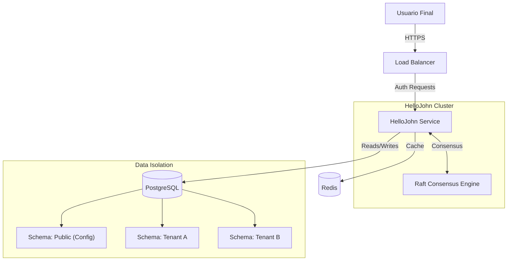
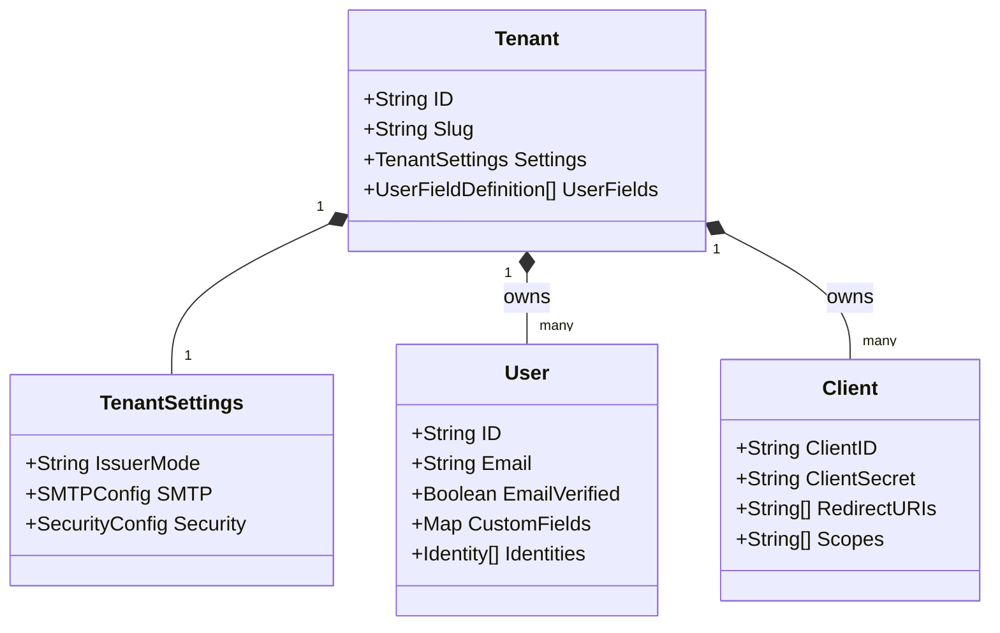
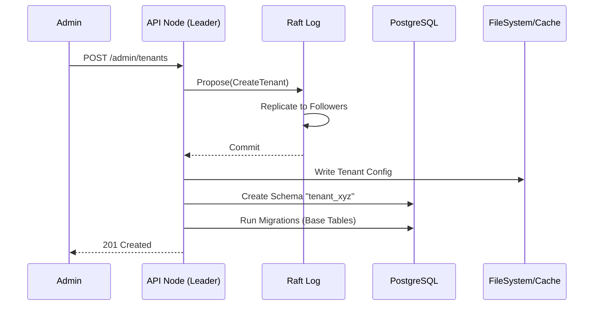
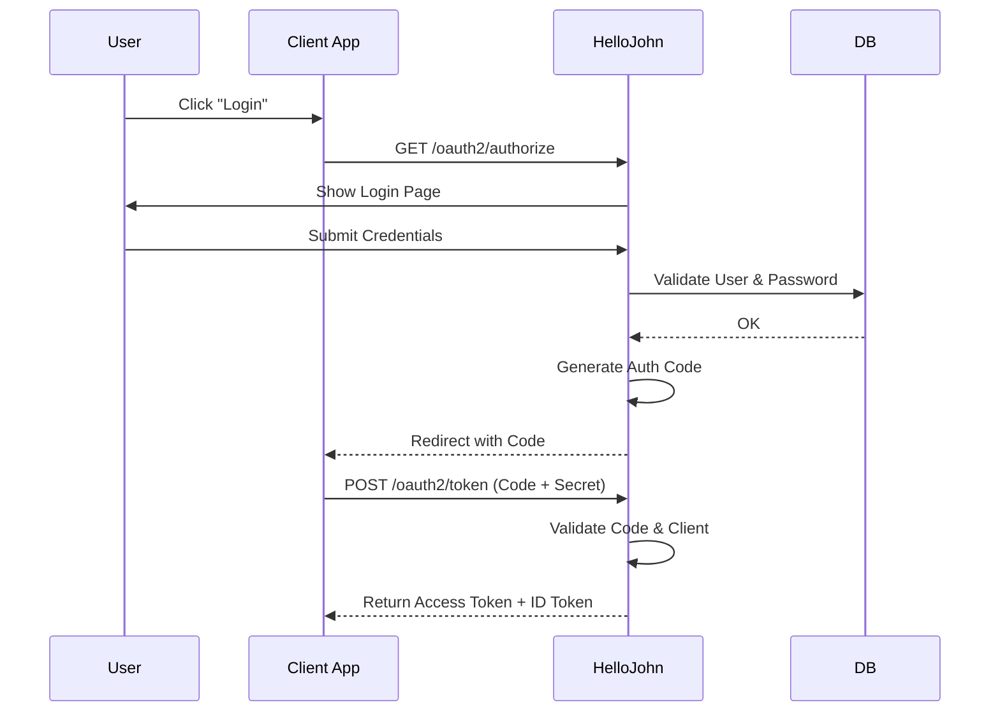

# HelloJohn (En desarrollo)

> **Plataforma de Identidad y Autenticación Multi-tenant Distribuida**
>
> HelloJohn es una solución moderna, segura y escalable para la gestión de identidad (IAM), diseñada para soportar múltiples organizaciones (tenants) con aislamiento estricto de datos y configuración flexible.


> **Documentación Extendida (Deep Dives):**
> *   [🤖 Documentación Interactiva](https://deepwiki.com/dropDatabas3/hellojohn)
> *   [🏛 Arquitectura: Control Plane & Raft](docs/architecture/control_plane_raft.md)
> *   [💾 Datos & Multi-tenancy](docs/data/multitenancy.md)
> *   [🔒 API, Auth & Seguridad](docs/api/endpoints_security.md)
> *   [📖 Referencia de API Endpoints](docs/api/reference.md)
> *   [⚙️ Infraestructura & Operaciones](docs/ops/infra_util.md)

---

## 📋 Tabla de Contenido

1. [Introducción](#-introducción)
2. [Características Principales](#-características-principales)
3. [Arquitectura del Sistema](#-arquitectura-del-sistema)
4. [Tecnologías](#-tecnologías)
5. [Estructuras de Datos](#-estructuras-de-datos)
6. [Flujos Principales](#-flujos-principales)
7. [Guía de Inicio](#-guía-de-inicio)
8. [Referencia de API](#-referencia-de-api)
9. [Roadmap Futuro](#-roadmap-futuro)

---

## 🚀 Introducción

HelloJohn nace de la necesidad de tener un sistema de autenticación robusto que pueda escalar horizontalmente y manejar configuraciones complejas por cliente (tenant) sin sacrificar el rendimiento ni la seguridad. A diferencia de soluciones monolíticas tradicionales, HelloJohn separa claramente el **Control Plane** (gestión de configuración distribuida) del **Data Plane** (autenticación y datos de usuario), utilizando algoritmos de consenso para garantizar la consistencia en entornos distribuidos.

Su diseño modular permite que cada tenant tenga su propio esquema de base de datos, configuración de seguridad, proveedores de identidad y campos de usuario personalizados, todo gestionado desde una única instancia de la plataforma.

---

## ✨ Características Principales

*   **Multi-tenancy Nativo**: Aislamiento total de datos. Cada tenant opera en su propio esquema de base de datos (`tenant_{slug}`), garantizando seguridad y facilidad de mantenimiento.
*   **Arquitectura Distribuida (Raft)**: Utiliza el algoritmo de consenso Raft para la gestión de configuración y estado del clúster, asegurando alta disponibilidad y consistencia fuerte para las operaciones críticas del Control Plane. [📖 Leer más sobre Arquitectura y Raft](docs/architecture/control_plane_raft.md)
*   **Gestión de Usuarios Flexible**: Soporte para **Campos Dinámicos**. Los administradores pueden definir campos personalizados (texto, número, booleano) que se integran nativamente en el esquema de la base de datos y en las APIs. [📖 Leer más sobre Gestión de Datos](docs/data/multitenancy.md)
*   **Estándares Abiertos**: Implementación completa de **OIDC (OpenID Connect)** y **OAuth2**, facilitando la integración con cualquier aplicación cliente. [📖 Leer más sobre API y Auth](docs/api/endpoints_security.md)
*   **Panel de Administración Moderno**: Una interfaz de usuario reactiva construida con Next.js 16, que permite gestionar tenants, usuarios, clientes OAuth y configuraciones del sistema en tiempo real.
*   **Seguridad Primero**: Rotación automática de claves (JWKS), encriptación de secretos en reposo, y soporte para MFA (TOTP).

---

## 🏗 Arquitectura del Sistema

HelloJohn sigue una arquitectura hexagonal (Ports and Adapters) para desacoplar la lógica de negocio de la infraestructura.

### Diagrama de Alto Nivel



### Componentes

1.  **Control Plane**: Gestiona la configuración global, tenants y coordinación del clúster. Utiliza Raft para replicar cambios de configuración (ej: creación de un nuevo tenant) a todos los nodos.
2.  **Data Plane**: Maneja el tráfico de autenticación (Login, Token, UserInfo). Lee la configuración localmente (replicada por el Control Plane) para máxima velocidad.
    > 📘 [Profundizar en la Arquitectura Raft](docs/architecture/control_plane_raft.md)
3.  **Storage Layer**:
    *   **PostgreSQL**: Almacenamiento persistente. Usa un esquema `public` para metadatos del clúster y esquemas dedicados (`tenant_xyz`) para datos de usuarios.
    *   **Redis**: Capa de caché para sesiones y tokens efímeros (opcional pero recomendado).

---

## 🛠 Tecnologías

### Backend
*   **Lenguaje**: [Go 1.23](https://go.dev/) - Rendimiento y concurrencia.
*   **Router**: `chi` - Ligero y compatible con `net/http`.
*   **Base de Datos**: `pgx/v5` - Driver PostgreSQL de alto rendimiento.
*   **Consenso**: `hashicorp/raft` - Implementación robusta de Raft.
*   **Seguridad**: `golang-jwt`, `crypto`.

> ⚙️ [Ver detalles de Infraestructura e Implementación](docs/ops/infra_util.md)

### Frontend (Panel de Administración)

Ubicado en la carpeta `ui/`, este panel es el centro de control de HelloJohn.
*   **Funcionalidades**:
    *   **Gestión de Organizaciones**: Crear, suspender y configurar tenants.
    *   **Gestión de Usuarios**: ABM completo de usuarios con soporte para Campos Dinámicos.
    *   **Clientes OAuth**: Registro y configuración de apps cliente.
    *   **Configuración**: Ajustes de seguridad, SMTP y personalización visual.
*   **Arquitectura**: Diseñado para ser exportado estáticamente y **embebido dentro del binario de Go**, permitiendo una distribución de "Single Binary" sin dependencias externas de Node.js en producción.
*   **Stack**: Next.js 16 (App Router), React 19, Tailwind CSS 4, React Query, Zustand.

---

## 📊 Estructuras de Datos

El modelo de datos está diseñado para flexibilidad y rendimiento.



### Campos Dinámicos
Los `CustomFields` en el usuario no son un simple JSON blob. El sistema realiza migraciones de esquema (`ALTER TABLE`) para agregar columnas reales a la tabla `app_user` del tenant, permitiendo consultas SQL eficientes e indexación sobre estos campos.

> 📘 [Detalles sobre Multi-tenancy y Campos Dinámicos](docs/data/multitenancy.md)

---

## 🔄 Flujos Principales

### 1. Creación de Tenant (Vía Raft)
Este flujo asegura que todos los nodos del clúster conozcan al nuevo tenant antes de que este pueda servir tráfico.



### 2. Autenticación OIDC (Authorization Code Flow)



---

## 🏁 Guía de Inicio

### Prerrequisitos
*   Go 1.23+
*   Node.js 20+
*   PostgreSQL 14+
*   Docker (opcional)

### Ejecución Local

1.  **Clonar el repositorio**
    ```bash
    git clone https://github.com/dropDatabas3/hellojohn.git
    cd hellojohn
    ```

2.  **Configurar Entorno**
    Copia el archivo de ejemplo y ajusta las credenciales de base de datos.
    ```bash
    cp .env.example .env
    ```

3.  **Iniciar Servicios (Docker Compose)**
    ```bash
    docker-compose up -d postgres redis
    ```

4.  **Ejecutar Backend**
    ```bash
    go run ./cmd/service
    ```

5.  **Ejecutar Frontend (Admin Panel)**
    ```bash
    cd ui
    npm install
    npm run dev
    ```
    Accede a `http://localhost:3000` para ver el panel de administración.

---

## 🔌 Referencia de API

### Admin API
*   `GET /v1/admin/tenants`: Listar todos los tenants.
*   `POST /v1/admin/tenants`: Crear un nuevo tenant.
*   `PUT /v1/admin/tenants/{slug}/settings`: Actualizar configuración (incluyendo campos dinámicos).
*   `GET /v1/admin/tenants/{slug}/users`: Listar usuarios de un tenant.
*   `POST /v1/admin/tenants/{slug}/users`: Crear usuario en un tenant.

### Auth API
*   `GET /oauth2/authorize`: Iniciar flujo de login.
*   `POST /oauth2/token`: Intercambiar código por token.
*   `GET /userinfo`: Obtener perfil del usuario.
*   `GET /.well-known/openid-configuration`: Descubrimiento OIDC.

> 📖 **[Ver Referencia Completa de API y Endpoints](docs/api/reference.md)**  
> 🔒 **[Ver Guía de Seguridad y Tokens](docs/api/endpoints_security.md)**

---

## 🔮 Roadmap Futuro

Hacia dónde nos dirigimos para hacer de HelloJohn la plataforma de identidad definitiva:

*   **Soporte Multi-Driver de Base de Datos**: Abstracción de la capa de almacenamiento para soportar no solo PostgreSQL, sino también MySQL, SQLite (para Edge/IoT) y bases de datos distribuidas como CockroachDB.
*   **Componentes UI Exportables (En Progreso)**: Estamos trabajando en desacoplar los formularios de login/registro para crear una librería de componentes que puedan ser integrados directamente en las aplicaciones de los clientes.
*   **Claims Dinámicos & RBAC Avanzado**: Implementación de un motor de reglas (posiblemente basado en CEL o Lua) para inyectar *claims* personalizados en los tokens en tiempo de ejecución, basados en contexto (IP, hora, grupo).
*   **Auditoría y Observabilidad**: Sistema de logs estructurados y dashboards integrados para visualizar eventos de seguridad, intentos de login fallidos y actividad de administración.
*   **Integración con WebAuthn/Passkeys**: Soporte nativo para autenticación biométrica sin contraseñas.

---

