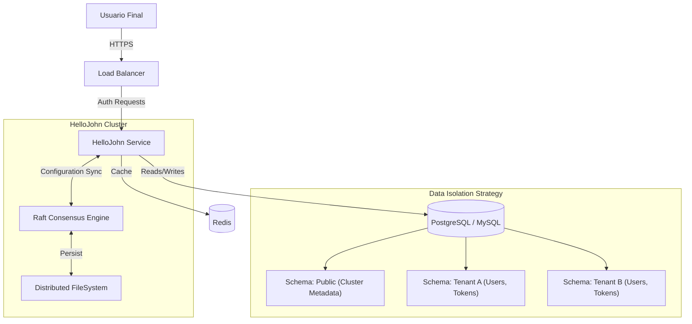

# HelloJohn

> **The Developer-First Identity Platform**
>
> Una alternativa self-hosted, multi-tenant y open-source a Auth0, Clerk y Keycloak. Diseñada para desarrolladores que necesitan control total sin la complejidad operacional.


---

## ¿Qué es HelloJohn?

**HelloJohn** es una plataforma de identidad (IAM) moderna, diseñada desde cero para ser **multi-tenant nativa**. A diferencia de soluciones tradicionales que requieren bases de datos compartidas o complejas configuraciones de infraestructura, HelloJohn utiliza una arquitectura de **Control Plane distribuido (Raft)** para la gestión global y **Data Plane aislado (Per-Tenant DB)** para la seguridad de los datos.

### Diferenciadores Clave

| Característica | HelloJohn | Auth0 / Clerk | Keycloak |
| :--- | :--- | :--- | :--- |
| **Modelo de Datos** | **Aislamiento Físico** (DB por Tenant) | Lógico (Columnas `tenant_id`) | Realms (Lógico) |
| **Control Plane** | **FileSystem Distribuido (Raft)** | Base de Datos Central | Base de Datos Central |
| **Drivers DB** | **Múltiples** (Postgres, MySQL, Mongo*) | Propietario / Cloud | Relational Only |
| **Costo** | **Self-Hosted (Gratis)** | $$$ por usuario/MAU | Gratis (Alto TCO ops) |
| **Developer Exp** | **SDKs Simples**, API Rest Standard | Excelente | Curva de aprendizaje alta |

> (*) MongoDB soporte planeado.

---

## Arquitectura

HelloJohn implementa una **Arquitectura Hexagonal (Ports & Adapters)** estricta, desacoplando la lógica de negocio de la infraestructura.

### Diagrama de Alto Nivel



### Componentes Core

1.  **Control Plane (The Brain)**: Gestiona la configuración global (Tenants, Applications, Keys). Utiliza **Raft** para replicar cambios a todos los nodos del clúster en tiempo real, asegurando consistencia fuerte sin depender de una base de datos central.
    *   *Ver:* [`internal/controlplane`](internal/controlplane/README_MODULE.md), [`internal/cluster`](internal/cluster/README.md)
2.  **Data Plane (The Muscle)**: Maneja el tráfico de alta velocidad (Login, Token Exchange, User Info). Se conecta directamente a la base de datos aislada del tenant correspondiente para leer/escribir datos de usuarios.
    *   *Ver:* [`internal/store`](internal/store/README.md), [`internal/store/adapters`](internal/store/adapters/README.md)
3.  **Authentication Engine**: Implementa los estándares OIDC y OAuth2.
    *   *Ver:* [`internal/oauth`](internal/oauth/README.md), [`internal/jwt`](internal/jwt/README.md), [`internal/security`](internal/security/README.md)

---

## Características Principales

*   **Multi-Tenancy Real**: Cada tenant puede tener su propia base de datos, driver (ej: Tenant A en Postgres, Tenant B en MySQL) y configuración de seguridad.
*   **Campos Dinámicos (Schema Migrations)**: Los administradores pueden definir campos personalizados en el perfil de usuario que se convierten en columnas reales en la base de datos del tenant.
*   **Panel de Administración Moderno**: Una SPA construida con Next.js 16 y Tailwind CSS 4, embebida en el binario final de Go para un despliegue "Single File".
*   **Seguridad Primero**:
    *   Rotación automática de claves de firma (JWKS).
    *   Cifrado de secretos en reposo (ChaCha20-Poly1305).
    *   Protección contra ataques de fuerza bruta y rate limiting distribuido.

---

## Documentación de Módulos

El código está organizado modularmente para facilitar la contribución y mantenimiento.

### 🔹 Núcleo (Core)
*   **[`internal/app`](internal/app/README.md)**: Entrypoint y wiring de la aplicación.
*   **[`internal/bootstrap`](internal/bootstrap/README.md)**: Inicialización y carga de configuración.
*   **[`internal/config`](internal/config/README.md)**: Gestión de variables de entorno y configuración global.

### 🔹 Capa HTTP & API
*   **[`internal/http/router`](internal/http/router/README.md)**: Definición de rutas y mapeo de endpoints.
*   **[`internal/http/controllers`](internal/http/controllers/README.md)**: Manejadores de peticiones HTTP (Translation Layer).
*   **[`internal/http/services`](internal/http/services/README.md)**: Lógica de negocio y orquestación.
*   **[`internal/http/middlewares`](internal/http/middlewares/README.md)**: Autenticación, Rate Limiting, CORS, Context.
*   **[`internal/http/dto`](internal/http/dto/README.md)**: Estructuras de transferencia de datos (Request/Response).

### 🔹 Datos & Persistencia
*   **[`internal/store`](internal/store/README.md)**: Capa de Acceso a Datos (DAL) abstracta.
*   **[`internal/store/adapters`](internal/store/adapters/README.md)**: Implementaciones concretas (Postgres, MySQL, FS).
*   **[`migrations`](migrations/README.md)**: Scripts SQL para control de versiones de esquema.

### 🔹 Seguridad & Identidad
*   **[`internal/jwt`](internal/jwt/README.md)**: Emisión y validación de tokens (Access, ID, Refresh).
*   **[`internal/oauth`](internal/oauth/README.md)**: Implementación de flujos OAuth2 y OIDC.
*   **[`internal/claims`](internal/claims/README.md)**: Gestión de claims estándar y personalizados.
*   **[`internal/security`](internal/security/README.md)**: Hashing de contraseñas (Argon2), TOTP, Cifrado simétrico.

### 🔹 Utilidades & Observabilidad
*   **[`internal/email`](internal/email/README_MODULE.md)**: Servicio de envío de correos transaccionales.
*   **[`internal/observability`](internal/observability/README.md)**: Logging estructurado, Métricas y Tracing.
*   **[`internal/cache`](internal/cache/README.md)**: Abstracción de caché distribuida.

---

## 🏁 Guía de Inicio Rápido

### Prerrequisitos
*   **Go** 1.23+
*   **PostgreSQL** 14+ (u otro motor soportado)
*   **Redis** (Opcional, recomendado para producción)

### 1. Clonar y Configurar
```bash
git clone https://github.com/dropDatabas3/hellojohn.git
cd hellojohn
cp .env.example .env
# Editar .env con tus credenciales de base de datos
```

### 2. Ejecutar con Docker Compose (Recomendado)
```bash
docker-compose up -d --build
```
Esto levantará:
*   HelloJohn Service (`:8080`)
*   Admin Panel (`:3000` - en modo dev, o embebido en `:8080` en prod)
*   PostgreSQL
*   Redis

### 3. Ejecutar Manualmente (Desarrollo)
```bash
# Terminal 1: Backend
go run ./cmd/service

# Terminal 2: Frontend (Admin)
cd ui && npm install && npm run dev
```

### 4. Acceder
*   **Admin Panel**: [http://localhost:3000](http://localhost:3000) (Usuario inicial se crea en el primer arranque si `FS_ADMIN_ENABLE=true`).
*   **OIDC Discovery**: [http://localhost:8080/.well-known/openid-configuration](http://localhost:8080/.well-known/openid-configuration)

---

## Variables de Entorno Críticas

| Variable | Descripción | Ejemplo / Default |
| :--- | :--- | :--- |
| `SIGNING_MASTER_KEY` | Hex Key (64 chars) para firma JWT | `a1b2...` |
| `SECRETBOX_MASTER_KEY` | Base64 Key (32 bytes) para cifrado DB | `c3d4...` |
| `FS_ROOT` | Directorio raíz del Control Plane | `./data` |
| `V2_SERVER_ADDR` | Dirección de escucha HTTP | `:8080` |

---


> **HelloJohn** - Built with ❤️ by developers, for developers.
