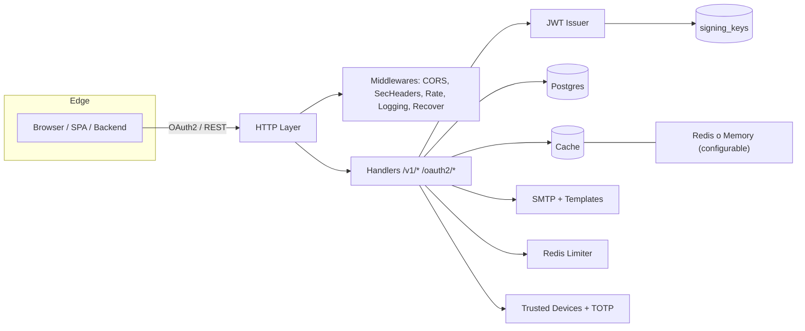
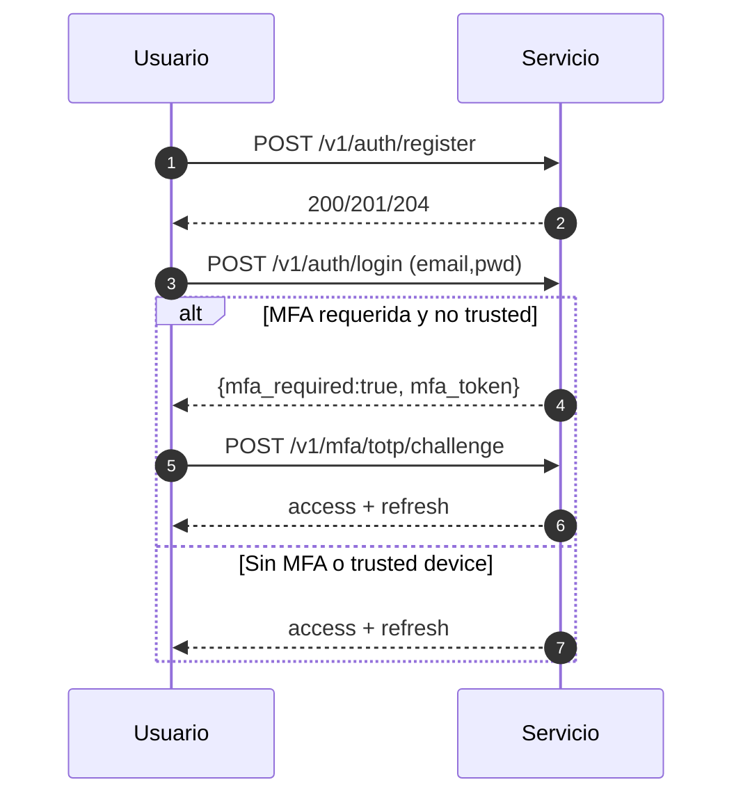
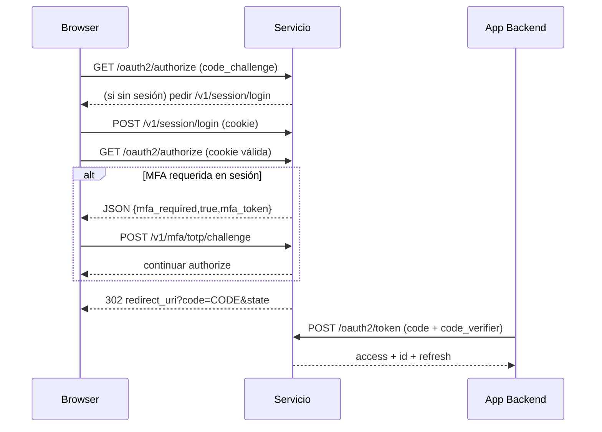
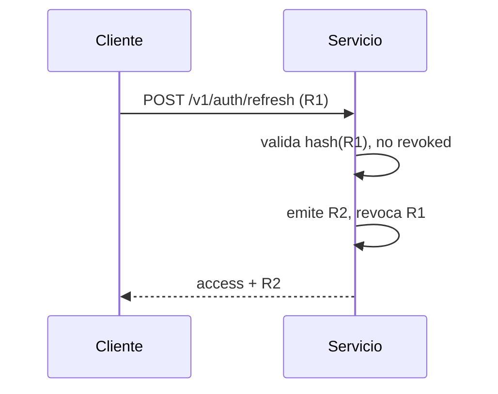

<div align="center">

# HelloJohn – Universal Login & Identity Service

Autenticación unificada (password, OAuth2/OIDC, social Google, MFA TOTP), gestión de sesiones y emisión segura de tokens multi‑tenant.

</div>

---

## Issuer/JWKS por tenant (Fase 5)

Objetivo: cada tenant emite tokens con su propio iss y su propio JWKS.

Modos:
- global (default, compat): iss = {baseURL}, .well-known/jwks.json global.
- path (MVP F5): iss = {baseURL}/t/{slug}, jwks_uri = {baseURL}/.well-known/jwks/{slug}.json.

### Activación por tenant

```bash
# Habilitar modo path para el tenant acme
curl -sS -H "X-Admin-API-Key: dev-key" -H "If-Match: *" \
  -X PUT "$BASE/v1/admin/tenants/acme" \
  -d '{"slug":"acme","settings":{"issuerMode":"path"}}' | jq .settings.issuerMode
```

### Discovery por tenant

```bash
curl -s "$BASE/t/acme/.well-known/openid-configuration" | jq '{issuer,jwks_uri,authorization_endpoint,token_endpoint}'
# -> issuer:   {base}/t/acme
# -> jwks_uri: {base}/.well-known/jwks/acme.json
```

Los endpoints authorize/token/userinfo se mantienen globales por compatibilidad.

### JWKS

```bash
# Por tenant
curl -s "$BASE/.well-known/jwks/acme.json" | jq -r '.keys[].kid'

# Global (compat)
curl -s "$BASE/.well-known/jwks.json" | jq -r '.keys[].kid'
```

### Emisión y verificación

```bash
# Login en acme -> iss por tenant + kid del tenant
TOK=$(curl -s -X POST "$BASE/v1/auth/login" \
  -d '{"tenantId":"acme","clientId":"web-frontend","email":"u@acme.test","password":"Passw0rd!"}' \
  | jq -r .access_token)

python - <<'PY'
import os,jwt
t=os.environ["TOK"]; h=jwt.get_unverified_header(t); p=jwt.decode(t, options={"verify_signature":False})
print("kid:",h.get("kid")); print("iss:",p.get("iss"))
PY
```

### Rotación de claves por tenant

```bash
# Rota la clave del tenant (mantiene ventana de gracia para validar tokens viejos)
curl -s -H "X-Admin-API-Key: dev-key" \
  -X POST "$BASE/v1/admin/tenants/acme/keys/rotate" | jq .

# Durante la gracia, JWKS del tenant incluye old+new kid
curl -s "$BASE/.well-known/jwks/acme.json" | jq -r '.keys[].kid'
```

Notas de seguridad:

- Cache-Control: no-store en .well-known y flujos sensibles.
- Los JWKS y la firma usan llaves aisladas por tenant en modo path.
- Rotación con ventana de gracia configurable.

---

### Config – ejemplo (opcional)

Agregar ejemplo en configs/config.example.yaml o en README:

```yaml
# Admin API (JWT)
# Desde Sprint 7, las rutas /v1/admin requieren Authorization: Bearer <token> (JWT admin).
# El uso de X-Admin-API-Key queda deprecado.

# Fase 5: rotación
KEY_ROTATION_GRACE_SECONDS: 60

# Ejemplo de tenant (control-plane FS) con issuerMode path:
# data/hellojohn/tenants/acme/tenant.yaml
# slug: acme
# settings:
#   issuerMode: path
#   # issuerOverride: ""   # reservado futuro (domain/override)
```

### CLI rápido (Sprint 7)

```bash
# Login (o pasa HELLOJOHN_BEARER)
export HELLOJOHN_ADMIN_URL="http://localhost:8080"
export HELLOJOHN_EMAIL="admin@example.com"
export HELLOJOHN_PASSWORD="Passw0rd!"
export HELLOJOHN_TENANT_ID="local"
export HELLOJOHN_CLIENT_ID="local-web"

# Ping admin
go run ./cmd/hellojohn admin ping

# Cambiar issuerMode del tenant
go run ./cmd/hellojohn admin tenants set-issuer-mode --slug acme --mode path

# Rotar llaves del tenant (con 60s de gracia)
go run ./cmd/hellojohn admin tenants rotate-keys --slug acme --grace-seconds 60
```
## Índice
- [1. Introducción](#1-introducción)
- [2. Características](#2-características)
- [3. Arquitectura](#3-arquitectura)
- [4. Estructura del proyecto](#4-estructura-del-proyecto)
- [5. Requisitos](#5-requisitos)
- [6. Puesta en marcha rápida](#6-puesta-en-marcha-rápida)
  - [6.1 Con Docker (DB/Cache)](#61-con-docker-dbcache)
  - [6.2 Ejecutar el servicio](#62-ejecutar-el-servicio)
- [7. Configuración](#7-configuración)
  - [7.1 Variables clave](#71-variables-clave)
  - [7.2 Blacklist de contraseñas](#72-blacklist-de-contraseñas)
- [8. Catálogo de endpoints](#8-catálogo-de-endpoints)
  - [8.1 Administración (JWT admin)](#81-administración-jwt-admin)
- [9. Admin: autenticación y autorización](#9-admin-autenticación-y-autorización)
- [10. Flujos principales](#10-flujos-principales)
- [11. Seguridad](#11-seguridad)
- [12. Rate limiting](#12-rate-limiting)
- [13. Migraciones, seed y claves](#13-migraciones-seed-y-claves)
- [14. Pruebas E2E](#14-pruebas-e2e)
- [15. Operación y salud](#15-operación-y-salud)
- [16. Roadmap](#16-roadmap)
- [17. Troubleshooting](#17-troubleshooting)
- [18. Glosario rápido](#18-glosario-rápido)
- [19. Changelog (resumen)](#19-changelog-resumen)
 - [Guía: Clientes y Microservicios](docs/clients_and_microservices.md)
 - [Docs HA E2E](docs/e2e_ha.md)
 - [Guía Multi-tenant](docs/multi-tenant_guide.md)

---

## 1. Introducción
HelloJohn es un servicio de identidad para apps web y backends que necesitan:
- Registro/login por email/password con política de contraseñas y blacklist opcional.
- OAuth2/OIDC Authorization Code + PKCE (S256) para SPAs, mobile y backends.
- Emisión de Access/ID/Refresh tokens (EdDSA Ed25519) con JWKS y rotación de claves.
- Login social (Google) con state firmado y código efímero (login_code).
- Verificación de email y recuperación de contraseña.
- MFA TOTP con trusted devices y códigos de recuperación.
- Introspección de tokens y revocación masiva de sesiones.
- Rate limiting semántico.

Todo expone JSON consistente, headers de seguridad y convenciones pensadas para integraciones multi‑tenant.

---

## 2. Características
- Multi‑tenant y clients versionados.
- Consentimientos por usuario/cliente con scopes dinámicos.
- Revocación de refresh tokens en cascada al revocar consentimientos/cliente o desactivar usuario.
- Keystore persistente con rotación de claves y JWKS.
- Cache abstracta (memory/redis) y rate limiter semántico.

---

## 3. Arquitectura


---

## 4. Estructura del proyecto
```
cmd/
  service/        # Servicio HTTP principal
  migrate/        # Migraciones DB
  seed/           # Seed de datos
  keys/           # Gestión de claves (rotate/list/retire)
configs/          # YAML (ejemplo y real) + blacklist opcional
deployments/      # docker-compose (Postgres/Redis) y Dockerfile (WIP)
internal/         # Código del dominio (HTTP, handlers, stores, JWT, MFA, etc.)
migrations/       # SQL/JS para motores soportados
templates/        # Emails (txt/html)
test/             # Suite E2E
```

---

## 5. Requisitos
- Go 1.23+
- Postgres 16 (dev mediante docker‑compose) y Redis (opcional, recomendado para rate/cache)
- SMTP para emails (en desarrollo puede usarse un servidor de pruebas)

Nota de alcance v1:
- Esta versión v1 soporta oficialmente Postgres como base de datos. MySQL y MongoDB no están soportados en v1.

---

## 6. Puesta en marcha rápida

### 6.1 Con Docker (DB/Cache)
En desarrollo podés levantar Postgres y Redis con `deployments/docker-compose.yml`.

Opcional
```
docker compose -f deployments/docker-compose.yml up -d
```

### 6.2 Ejecutar el servicio
1) Copiá el ejemplo y/o usa variables de entorno:
```
cp configs/config.example.yaml configs/config.yaml
```
2) Definí una master key para cifrado (mínimo 32 bytes):
```
setx SIGNING_MASTER_KEY 0123456789abcdef0123456789abcdef0123456789abcdef0123456789abcdef
```
3) Iniciá el servicio (con migraciones automáticas):
```
go run ./cmd/service -env
```

Notas
- Por defecto escucha en :8080.
- El flag `-env` usa solo variables de entorno (y `.env` si pasás `-env-file`).

#### UI embebida (puerto dedicado)

Desde Sprint 7 el servicio puede servir una GUI de administración embebida en un puerto separado:

- ADMIN_UI_DIR: carpeta con los archivos estáticos ya construidos del UI (por ejemplo, el output de `next export` o un build de SPA)
- UI_SERVER_ADDR: dirección de escucha para la UI (por ejemplo, `:8081` o `0.0.0.0:8081`)
- UI_PUBLIC_ORIGIN: origen público para la UI (opcional). Si no se define, se intenta deducir `http://localhost:<puerto>` a partir de UI_SERVER_ADDR; este origen se agrega automáticamente a `SERVER_CORS_ALLOWED_ORIGINS` para que la UI pueda llamar al API.

Ejemplo rápido en dev (Windows PowerShell):

```
$env:ADMIN_UI_DIR = "$(Resolve-Path ./ui/out)"  # apunte a la carpeta estática ya generada
$env:UI_SERVER_ADDR = ":8081"
go run ./cmd/service -env
```

Notas:
- El API continúa en `SERVER_ADDR` (por defecto `:8080`).
- La UI se sirve en `UI_SERVER_ADDR` con una CSP relajada para permitir recursos inline típicos de SPAs.
- Si preferís montar la UI bajo el mismo puerto (legacy), podés no definir `UI_SERVER_ADDR` y servirla aparte con un reverse proxy.

Atajo con script (Windows PowerShell):

```
pwsh -File scripts/dev-ui.ps1
```

El script instala deps (pnpm/npm), exporta el UI a `ui/out` y levanta el servicio con:
- API en http://localhost:8080
- UI en http://localhost:8081

---

## 7. Configuración
Precedencia: defaults → config.yaml → env → flags.

### 7.1 Variables clave
- Servidor: SERVER_ADDR, SERVER_CORS_ALLOWED_ORIGINS
- UI embebida: ADMIN_UI_DIR, UI_SERVER_ADDR, UI_PUBLIC_ORIGIN
- JWT: JWT_ISSUER, JWT_ACCESS_TTL, JWT_REFRESH_TTL
- Storage: STORAGE_DRIVER, STORAGE_DSN, POSTGRES_MAX_OPEN_CONNS, POSTGRES_MAX_IDLE_CONNS, POSTGRES_CONN_MAX_LIFETIME
- Cache/Redis: CACHE_KIND, REDIS_ADDR, REDIS_DB, REDIS_PREFIX, CACHE_MEMORY_DEFAULT_TTL
- Registro/Auth: REGISTER_AUTO_LOGIN, AUTH_ALLOW_BEARER_SESSION
- Sesión: AUTH_SESSION_COOKIE_NAME, AUTH_SESSION_DOMAIN, AUTH_SESSION_SAMESITE, AUTH_SESSION_SECURE, AUTH_SESSION_TTL
- Introspección: INTROSPECT_BASIC_USER, INTROSPECT_BASIC_PASS
- Email flows/SMTP: AUTH_VERIFY_TTL, AUTH_RESET_TTL, AUTH_RESET_AUTO_LOGIN, EMAIL_BASE_URL, EMAIL_TEMPLATES_DIR, EMAIL_DEBUG_LINKS, SMTP_*
- Rate global/por‑endpoint: RATE_ENABLED, RATE_WINDOW, RATE_MAX_REQUESTS, RATE_* (login/forgot/MFA)
- Password: SECURITY_PASSWORD_POLICY_*, SECURITY_PASSWORD_BLACKLIST_PATH
- Social Google: GOOGLE_ENABLED, GOOGLE_CLIENT_ID/SECRET, GOOGLE_REDIRECT_URL, GOOGLE_SCOPES, GOOGLE_ALLOWED_TENANTS/CLIENTS, SOCIAL_LOGIN_CODE_TTL
- Claves: SIGNING_MASTER_KEY
 - Cluster TLS (Raft): RAFT_TLS_ENABLE, RAFT_TLS_CERT_FILE (o RAFT_TLS_CERT), RAFT_TLS_KEY_FILE (o RAFT_TLS_KEY), RAFT_TLS_CA_FILE (o RAFT_TLS_CA), RAFT_TLS_SERVER_NAME
 - Leader redirects allowlist (opcional): LEADER_REDIRECT_ALLOWED_HOSTS (CSV de host[:port] separado por coma o punto y coma)

Autoconsent (seguro por defecto):
- CONSENT_AUTO=1
- CONSENT_AUTO_SCOPES="openid email profile"

### 7.2 Blacklist de contraseñas
1. Crear archivo con una contraseña por línea. Líneas vacías o con `#` se ignoran.
2. Definir ruta vía YAML o env `SECURITY_PASSWORD_BLACKLIST_PATH`.
3. Reiniciar el servicio.

---

## 8. Catálogo de endpoints
Autenticación básica:
`POST /v1/auth/register`, `POST /v1/auth/login`, `POST /v1/auth/refresh`, `POST /v1/auth/logout`, `POST /v1/auth/logout-all`, `GET /v1/me`

Sesiones navegador:
`POST /v1/session/login`, `POST /v1/session/logout`

OAuth2 / OIDC:
`GET /oauth2/authorize`, `POST /oauth2/token`, `POST /oauth2/revoke`, `GET|POST /userinfo`, `GET /.well-known/openid-configuration`, `GET /.well-known/jwks.json`, `POST /oauth2/introspect`

Email flows:
`POST /v1/auth/verify-email/start`, `GET /v1/auth/verify-email`, `POST /v1/auth/forgot`, `POST /v1/auth/reset`

MFA:
`POST /v1/mfa/totp/enroll`, `POST /v1/mfa/totp/verify`, `POST /v1/mfa/totp/challenge`, `POST /v1/mfa/totp/disable`, `POST /v1/mfa/recovery/rotate`

Social:
`GET /v1/auth/social/google/start`, `GET /v1/auth/social/google/callback`, `POST /v1/auth/social/exchange`, `GET /v1/auth/providers`

Salud:
`GET /readyz`

### Perfil (Sprint 7)
`GET /v1/profile`

- Auth: Bearer (access token)
- Scope requerido: `profile:read`
- Respuesta 200 (JSON): `sub`, `email`, `email_verified`, `name`, `given_name`, `family_name`, `picture`, `updated_at`
- Headers: `Cache-Control: no-store`, `Pragma: no-cache`, `Content-Type: application/json; charset=utf-8`
- Usos: CLI `hellojohn whoami`, UI Cuenta/Perfil

### 8.1 Administración (JWT admin)
API base `/v1/admin/*` protegida por RequireAuth + RequireSysAdmin (ver sección 9).

En la fase 5 se consolidó el layout per‑tenant para CRUD de Tenants, Clients y Scopes bajo `/v1/admin/tenants/{slug}`:

- Tenants
  - GET `/v1/admin/tenants/{slug}` → obtiene tenant
  - PUT `/v1/admin/tenants/{slug}` → crea/actualiza tenant (idempotente)

- Clients por tenant
  - GET `/v1/admin/tenants/{slug}/clients` → lista
  - PUT `/v1/admin/tenants/{slug}/clients/{client_id}` → upsert (public/confidential)
  - DELETE `/v1/admin/tenants/{slug}/clients/{client_id}` → delete o revoca sesiones si `?soft=true`

- Scopes por tenant
  - GET `/v1/admin/tenants/{slug}/scopes` → lista
  - PUT `/v1/admin/tenants/{slug}/scopes` → reemplazo/merge de catálogo (validación regex/minúsculas)

- User‑store por tenant (DB de usuarios):
  - POST `/v1/admin/tenants/{slug}/user-store/test-connection`
  - POST `/v1/admin/tenants/{slug}/user-store/migrate`

- Rotación de claves por tenant
  - POST `/v1/admin/tenants/{slug}/keys/rotate` → mueve active→retiring (grace), crea nueva active

Consents y RBAC se mantienen bajo `/v1/admin/*` (globales respecto al issuer actual) y siguen las mismas reglas documentadas:

| Método | Path | Descripción | Notas |
|--------|------|-------------|-------|
| POST | /v1/admin/consents/upsert | Inserta o amplía consentimiento | Acepta client_id público o UUID |
| GET | /v1/admin/consents?user_id=&client_id=&active_only= | Filtra consentimientos | user+client ⇒ 0..1 |
| GET | /v1/admin/consents/by-user/{userID} | Lista consentimientos de usuario | `active_only` opcional |
| POST | /v1/admin/consents/revoke | Revoca consentimiento (soft) | Revoca refresh tokens |
| DELETE | /v1/admin/consents/{user_id}/{client_id} | Alias de revoke now() | Idempotente |
| GET | /v1/admin/rbac/users/{userID}/roles | Lista roles | Repos RBAC opcionales |
| POST | /v1/admin/rbac/users/{userID}/roles | Añade/Quita roles | Campos add/remove |
| GET | /v1/admin/rbac/roles/{role}/perms | Lista permisos rol | |
| POST | /v1/admin/rbac/roles/{role}/perms | Añade/Quita permisos | |

Validación de scopes (regex): `^[a-z0-9](?:[a-z0-9:_\.-]{0,62}[a-z0-9])?$` (1–64, minúsculas, caracteres permitidos `:_.-`).

Eliminación segura: antes de borrar un scope se verifica que no esté referenciado por `user_consent` activo en el mismo tenant; si lo está ⇒ 409 `scope_in_use`.

Upsert de consentimientos: unión de scopes sin duplicar y reactivación (revoked_at=NULL) cuando corresponda. La revocación marca `revoked_at` y revoca refresh del par (user, client).

---

## 9. Admin: autenticación y autorización
Las rutas `/v1/admin/*` se protegen con:
- RequireAuth: exige JWT Bearer válido emitido por el issuer configurado.
- RequireSysAdmin: verifica privilegios de administrador del sistema.

Política (middleware `RequireSysAdmin`):
1) Si `ADMIN_ENFORCE` ≠ "1" ⇒ permitir (modo dev/compatibilidad).
2) En claims.custom[SystemNamespace(iss)].is_admin == true ⇒ permitir.
3) En claims.custom[SystemNamespace(iss)].roles incluye "sys:admin" ⇒ permitir.
4) Fallback de emergencia: `sub` ∈ `ADMIN_SUBS` (CSV) ⇒ permitir.
Si no, 403.

Variables relevantes:
- ADMIN_ENFORCE=1
- ADMIN_SUBS="uuid-1,uuid-2"

Ejemplo (payload recortado):
```
{
  "iss": "http://localhost:8080",
  "sub": "<user-uuid>",
  "custom": {
    "urn:hellojohn:sys": {
      "is_admin": true,
      "roles": ["sys:admin"]
    }
  }
}
```

---

## 10. Flujos principales
### 10.1 Registro + Login (con MFA opcional)


### 10.2 OAuth2 Authorization Code (+ PKCE) con autoconsent


### 10.3 Refresh rotativo


### 10.4 Password Reset / Verificación Email / Social Google
Se mantienen los flujos estándar documentados en los endpoints (ver sección 8).

---

## 11. Seguridad
- Argon2id (passwords) con parámetros seguros.
- Blacklist opcional de contraseñas.
- PKCE S256.
- Refresh rotation.
- Ed25519 + JWKS.
- AES‑GCM en reposo para secretos TOTP y claves privadas.
- Headers de seguridad (CSP, no‑store, X‑Frame‑Options DENY, HSTS si HTTPS, etc.).
- Introspección y logout‑all.

---

## 12. Rate limiting
Dos capas:
1) Global (IP+path)
2) Pools específicos: login, forgot/reset, verify-email, MFA (enroll/verify/challenge/disable)
Redis almacena contadores con TTL de la ventana. Fallo de Redis ⇒ fail‑open (se registra en logs).

---

## 13. Migraciones, seed y claves
- Migrar DB: `go run ./cmd/migrate`
- Seed inicial: `go run ./cmd/seed`
- Servidor: `go run ./cmd/service -env`
- Rotar claves: `go run ./cmd/keys -rotate`
- Listar claves: `go run ./cmd/keys -list`
- Retirar claves: `go run ./cmd/keys -retire -retire-after=168h`

El servicio puede ejecutar migraciones al arrancar si `FLAGS_MIGRATE=true`.

---

## 14. Pruebas E2E
La suite `test/e2e` cubre registro/login, refresh, email flows, OAuth2, social (login_code), MFA, introspección, blacklist y administración (clients, scopes, consents, users disable/enable).

### 14.1 Habilitar un tenant (FS -> DB)
Pasos típicos para crear/habilitar un tenant y su user‑store por API admin (enviar siempre Content-Type: application/json):

1) Crear/actualizar tenant en FS (idempotente)
- Método: PUT /v1/admin/tenants/{slug}
- Header: Content-Type: application/json
- Body ejemplo:
  {"name":"Acme Inc","status":"active"}

2) Upsert cliente público
- Método: PUT /v1/admin/tenants/{slug}/clients/{client_id}
- Body ejemplo:
  {"name":"Web","client_type":"public","redirect_uris":["http://localhost/cb"],"providers":["password"],"scopes":["openid","email","profile"]}

3) Definir scopes disponibles
- Método: PUT /v1/admin/tenants/{slug}/scopes
- Body ejemplo:
  {"scopes":[{"name":"openid","description":""},{"name":"email"},{"name":"profile"}]}

4) Probar conexión al user‑store (501 si falta DSN)
- Método: POST /v1/admin/tenants/{slug}/user-store/test-connection

5) Migrar el user‑store (aplica schema por tenant)
- Método: POST /v1/admin/tenants/{slug}/user-store/migrate

Notas
- Si el tenant no existe en FS ⇒ 404 en test-connection/migrate.
- Si el tenant existe pero no tiene DSN ⇒ 501 tenant_db_missing (appcode 2601).
- Errores reales de DB ⇒ 500 tenant_db_error (appcode 2602).

---

## 15. Operación y salud
- Health: `GET /readyz` verifica DB, cache y keystore.
  - Campos extra: `cluster.role`, `cluster.leader_id`, `cluster.raft.*`, `fs_degraded` (true si el plano FS detectó errores recientes de escritura).
- Logs estructurados con request id.
- Timeouts y graceful shutdown configurables por ENV (`HTTP_*`).
 - Endpoint de shutdown para dev/test (opcional): habilitar con `ALLOW_DEV_SHUTDOWN=1` y llamar `POST /__dev/shutdown`.

---

## 16. Roadmap
- CLI y GUI de administración.
- Endpoints adicionales de administración (listado de usuarios, vistas/sesiones).
- Observabilidad (métricas, trazas).
- Extensión de providers y WebAuthn.

---

## 17. Troubleshooting
- 401 en `/v1/admin/*`: asegurate de enviar Bearer JWT válido y definir `ADMIN_ENFORCE=1` solo cuando el token tenga claims admin. `ADMIN_SUBS` puede servir de emergencia.
- 401 en `/oauth2/introspect`: definí `INTROSPECT_BASIC_USER/PASS` para habilitar basic auth del endpoint.
- 500 al iniciar: `SIGNING_MASTER_KEY` faltante o corto (mínimo 32 bytes).
- Emails no salen: revisá `SMTP_*` y `EMAIL_DEBUG_LINKS` (en prod se fuerza false).

---

## 18. Glosario rápido
| Término | Explicación |
|---------|------------|
| AMR | Métodos de autenticación empleados (pwd, mfa, google, refresh...). |
| ACR | Nivel de autenticación alcanzado (loa:1 básico, loa:2 con MFA). |
| PKCE S256 | Protección de authorization code mediante code_challenge hash. |
| login_code | Código efímero social one‑use para intercambiar por tokens. |
| MFA Trusted Device | Cookie + hash persistido que evita re-desafío TOTP dentro de TTL. |
| Refresh Rotation | Patrón de revocar el refresh anterior al emitir uno nuevo. |
| JWKS | Conjunto JSON de claves públicas activas/retiring. |
| GCMV1 / GCMV1-MFA | Prefijos de blobs cifrados AES-GCM (claves/mfa). |

---

## 19. Changelog (resumen)
| Ítem | Descripción |
|------|-------------|
| Migración 0003 | Tablas `scope` y `user_consent` + índices GIN y activos |
| Scopes API | CRUD con validación regex y delete seguro (409 in-use) |
| Consents API | Upsert union, revocación soft + revoca refresh tokens |
| Autoconsent | `CONSENT_AUTO` + `CONSENT_AUTO_SCOPES` para baseline scopes |
| Revocar robusto | /oauth2/revoke acepta form, JSON, Authorization Bearer |
| Password blacklist | Archivo configurable y test dedicado |
| Seed compat | Soporte campo `sub` -> `id` en seed YAML tests |
| RBAC inicial | Handlers roles/perms (lectura/escritura) sujetos a repos opcionales |

---
© 2025 HelloJohn – Documentación actualizada y alineada al código.

---

## Fase 6 — Paso 0: Flags de Clúster (HA habilitador)

Objetivo: agregar variables/config mínimas para encender el modo clúster embebido sin alterar el comportamiento por defecto.

Nuevas variables de entorno (y equivalentes en YAML bajo `cluster:`):
- CLUSTER_MODE=off|embedded (default: off)
- NODE_ID=<string único>
- RAFT_ADDR=<host:port> (bind local para transporte Raft)
- CLUSTER_NODES="node1=127.0.0.1:8201;node2=127.0.0.1:8202;node3=127.0.0.1:8203"
- LEADER_REDIRECTS="node1=http://127.0.0.1:8081;node2=http://127.0.0.1:8082;node3=http://127.0.0.1:8083"
- RAFT_SNAPSHOT_EVERY=50 (o usar RAFT_MAX_LOG_MB)

Comportamiento al arrancar:
- Con CLUSTER_MODE=off arranca como hoy.
- Con CLUSTER_MODE=embedded crea la carpeta `path.Join(CONTROL_PLANE_FS_ROOT,"raft")` si no existe (no hay lógica Raft todavía).

Pre‑requisitos operativos (compartidos entre nodos):
- SECRETBOX_MASTER_KEY base64(32 bytes) para secretos/DSN en YAML.
- SIGNING_MASTER_KEY (>=32 bytes) para cifrar privadas en `keys/`.
- CONTROL_PLANE_FS_ROOT apuntando a `data/hellojohn` (o volumen persistente equivalente).

---

## Fase 6 — Paso 1: Bootstrap estático multi‑nodo (3 nodos)

Con `CLUSTER_MODE=embedded` y `CLUSTER_NODES` definidos, el clúster se forma de manera determinista en un estado limpio (sin datos previos):

- El nodo cuyo `NODE_ID` sea lexicográficamente más pequeño realiza el bootstrap inicial con todos los peers de `CLUSTER_NODES` como votantes.
- Los demás nodos no bootstrappean; inician y se suman al clúster.
- Si solo hay 1 peer en `CLUSTER_NODES`, se aplica el bootstrap single‑node actual.

Notas operativas:
- El estado de Raft se guarda bajo `$(CONTROL_PLANE_FS_ROOT)/raft` en cada nodo.
- Reinicios conservan la membresía y no vuelven a bootstrappear.
- Recomendado usar direcciones estáticas/reachable en `RAFT_ADDR` para todos los nodos.

---

## Fase 6 — Paso 2: Readyz enriquecido (observabilidad)

El endpoint `GET /readyz` ahora expone información de clúster:

- `cluster.role`: leader | follower | single.
- `cluster.leader_id`: `NODE_ID` del líder cuando aplica.
- `cluster.peers_configured`: cantidad de peers en `CLUSTER_NODES`.
- `cluster.leader_redirects`: hints opcionales cargados desde `LEADER_REDIRECTS`.
- `raft.*`: métricas de Raft (p.ej. `num_peers`, `state`, `applied_index`, `commit_index`).

Usos típicos:
- Verificar quién es líder y el tamaño de la topología.
- Observar progreso de replicación (índices) y estado de cada nodo.

---

## Fase 6 — Paso 3: Script local para 3 nodos (Windows)

Se incluye `deployments/run-3nodes.ps1` para lanzar rápidamente 3 nodos locales:

- HTTP: 8081, 8082, 8083
- Raft: 8201, 8202, 8203
- Cada nodo usa su propio `CONTROL_PLANE_FS_ROOT` (carpetas `data/node1`, `data/node2`, `data/node3`).
- Variables mínimas: `SECRETBOX_MASTER_KEY`, `SIGNING_MASTER_KEY`, `CLUSTER_MODE`, `NODE_ID`, `RAFT_ADDR`, `CLUSTER_NODES`.

Opcional: definir `LEADER_REDIRECTS="n1=http://127.0.0.1:8081;n2=http://127.0.0.1:8082;n3=http://127.0.0.1:8083"` para que los followers puedan responder 307 al líder en writes.

---

## Fase 6 — Paso 4: E2E de HA (manual)

Escenario sugerido para validar alta disponibilidad y consistencia:

1) Arrancar el clúster con el script de 3 nodos.
  - Esperar unos segundos y consultar `/readyz` en 8081/8082/8083.
  - Debe haber exactamente un `cluster.role = leader` y dos `follower`.

2) Intentar una operación de escritura en un follower (por ejemplo, rotación de claves por tenant o actualización de tenant).
  - Sin `LEADER_REDIRECTS` configurado: esperar `409 leader_required`.
  - Con `LEADER_REDIRECTS` configurado: esperar `307` redirect al líder.

3) Ejecutar la misma operación en el líder.
  - Cambios deben replicarse a los 3 nodos.
  - Para rotación de claves por tenant, el JWKS del tenant debe ser idéntico en todos los nodos (rotación determinista replicada).

4) Simular failover: detener el proceso del líder.
  - Esperar re‑elección (pocos segundos) y verificar nuevo `cluster.role = leader` en `/readyz` de algún nodo.
  - Repetir una escritura: debe funcionar con el nuevo líder y replicarse.

5) Re‑iniciar el nodo anterior líder y comprobar que se reintegra como follower (o líder si corresponde tras una nueva elección futura).

Notas:
- La ventana de gracia en rotación (`KEY_ROTATION_GRACE_SECONDS`) permite que JWKS incluya old+new kids durante el período indicado.
- Los followers invalidan caché JWKS al aplicar mutaciones replicadas.

---

## 20. Cluster HA (Fase 6)

Esta sección resume el estado final de Alta Disponibilidad para el plano de control (tenants, clients, scopes, keys) mediante Raft embebido.

### 20.1 Objetivos alcanzados
| Objetivo | Estado |
|----------|--------|
| Escrituras consistentes sólo en líder | OK (middleware RequireLeader) |
| Followers devuelven 409 o 307 redirect | OK (Test 40) |
| Snapshot/restore produce JWKS idéntico | OK (Test 41) |
| Scope mínimo de gating (FS only) | OK |
| Rutas DB (consents/RBAC/users) sin gating | OK |

### 20.2 Variables principales
CLUSTER_MODE=1 habilita clúster. Además: NODE_ID, RAFT_ADDR, CLUSTER_NODES, LEADER_REDIRECTS (opcional), RAFT_SNAPSHOT_EVERY. Bootstrap: un nodo inicial con CLUSTER_BOOTSTRAP=1.

### 20.3 Gating de rutas (RequireLeader)
Gated (mutan FS): tenants (PUT), tenant clients CRUD, tenant scopes PUT, tenant key rotate.
No gated: consents, RBAC users/roles, users globales.

### 20.4 Semántica followers
- 409 follower_conflict (default). Headers: X-Leader, X-Leader-URL (si mapping).  
- 307 redirect cuando el cliente lo pide (`?leader_redirect=1` o header X-Leader-Redirect:1) y existe mapping en LEADER_REDIRECTS.

### 20.5 Snapshots & Restauración
Raft toma snapshots cada N ops (`RAFT_SNAPSHOT_EVERY`). El keystore y catálogo FS van en el snapshot. Borrar `raft/` en un follower y reiniciarlo ⇒ rejoin + JWKS igual al líder (verificado en Test 41 normalizando JSON).

### 20.6 Comandos locales (3 nodos ejemplo)
```
# Líder bootstrap
CLUSTER_MODE=1 CLUSTER_BOOTSTRAP=1 NODE_ID=n1 RAFT_ADDR=:18081 SERVER_ADDR=:8081 \
  LEADER_REDIRECTS="n1=http://127.0.0.1:8081,n2=http://127.0.0.1:8082,n3=http://127.0.0.1:8083" \
  CLUSTER_NODES="n1=127.0.0.1:18081,n2=127.0.0.1:18082,n3=127.0.0.1:18083" \
  go run ./cmd/service -env

# Seguidores
CLUSTER_MODE=1 NODE_ID=n2 RAFT_ADDR=:18082 SERVER_ADDR=:8082 CLUSTER_NODES="..." LEADER_REDIRECTS="..." go run ./cmd/service -env
CLUSTER_MODE=1 NODE_ID=n3 RAFT_ADDR=:18083 SERVER_ADDR=:8083 CLUSTER_NODES="..." LEADER_REDIRECTS="..." go run ./cmd/service -env
```

### 20.7 Failover
Al detener el líder, un follower se elige en pocos segundos. Reintentos de escritura: aplicar backoff + observar header X-Leader. Tras volver a levantar el nodo antiguo, se reintegra como follower.

### 20.8 Backups mínimos
Copiar directorio de datos del líder (`data/hellojohn`) incluyendo `raft/`, `tenants/`, `keys/`. Restaurar primero en modo single-node (CLUSTER_MODE=0) para validar, luego formar nuevo clúster.

### 20.9 Próximos (P1)
mTLS transporte Raft, métricas detalladas (apply latency), forzar snapshot manual, issuer domain overrides.

### 20.10 Scripts locales y CI futuro
Para el loop de desarrollo existen scripts PowerShell:
- `scripts/dev-ha.ps1`: ejecuta tests HA (40,41,42) con `E2E_SKIP_GLOBAL_SERVER=1` y `DISABLE_DOTENV=1`.
- `scripts/dev-smoke.ps1`: unit + subconjunto E2E básicos.

La integración CI (workflows) se integrará en una fase posterior; de momento no se versiona ningún pipeline automatizado.

### 20.11 Escenarios de uso y cobertura de tests
| Escenario | Descripción | Rutas implicadas | Test(s) que lo cubren |
|-----------|-------------|------------------|-----------------------|
| FS puro | Solo metadatos (tenants/clients/scopes/keys) replicados; DB global única | PUT tenants, clients CRUD, scopes, rotate keys | 40 (gating), 42 (canario) |
| FS + DB global | Metadatos replicados y operaciones DB (consents/RBAC/users) no gated | Añade consents/RBAC/users (sin RequireLeader) | 40 (asegura sólo FS gated) |
| FS + DB por tenant | Metadatos + user-store independiente por tenant (migraciones per-tenant) | Tenants + user-store migrate/test-connection | 40 (gating), 41 (consistencia claves tras restore) |
| Mixto (rotación + restore) | Rotación de claves + pérdida de estado follower + rejoin (snapshot) | rotate keys + JWKS fetch | 41 (snapshot/restore JWKS idéntico) |

Al agregar nuevos mutadores FS incluirlos en Test 42 (canario) para mantener esta matriz fiable.

