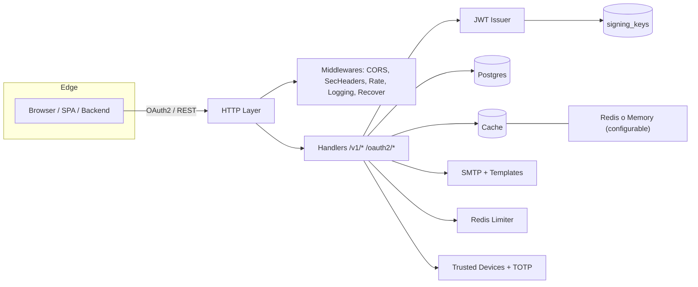
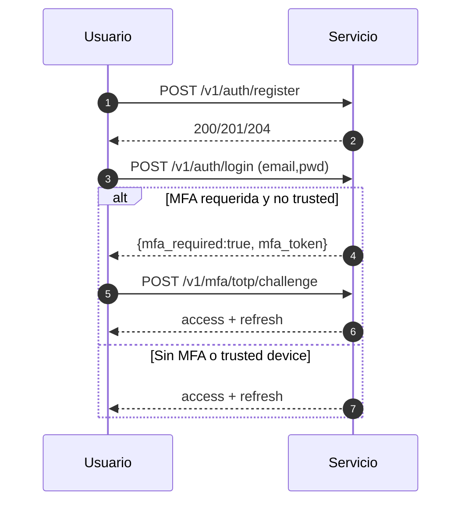
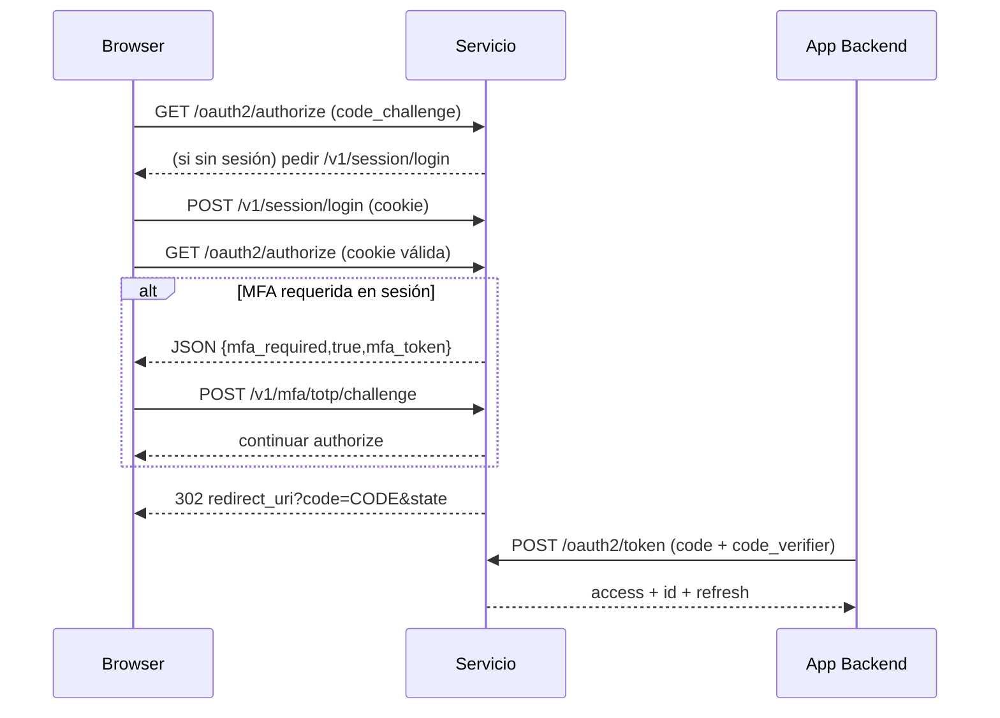
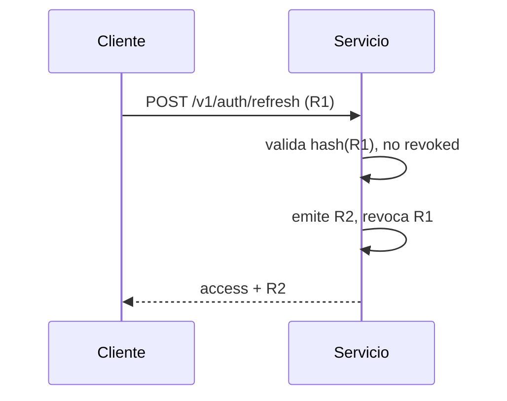

<div align="center">

# HelloJohn – Universal Login & Identity Service

Autenticación unificada (password, OAuth2/OIDC, social Google, MFA TOTP), gestión de sesiones y emisión segura de tokens multi‑tenant.

</div>

---

## Índice
- [1. Introducción](#1-introducción)
- [2. Características](#2-características)
- [3. Arquitectura](#3-arquitectura)
- [4. Estructura del proyecto](#4-estructura-del-proyecto)
- [5. Requisitos](#5-requisitos)
- [6. Puesta en marcha rápida](#6-puesta-en-marcha-rápida)
  - [6.1 Con Docker (DB/Cache)](#61-con-docker-dbcache)
  - [6.2 Ejecutar el servicio](#62-ejecutar-el-servicio)
- [7. Configuración](#7-configuración)
  - [7.1 Variables clave](#71-variables-clave)
  - [7.2 Blacklist de contraseñas](#72-blacklist-de-contraseñas)
- [8. Catálogo de endpoints](#8-catálogo-de-endpoints)
  - [8.1 Administración (JWT admin)](#81-administración-jwt-admin)
- [9. Admin: autenticación y autorización](#9-admin-autenticación-y-autorización)
- [10. Flujos principales](#10-flujos-principales)
- [11. Seguridad](#11-seguridad)
- [12. Rate limiting](#12-rate-limiting)
- [13. Migraciones, seed y claves](#13-migraciones-seed-y-claves)
- [14. Pruebas E2E](#14-pruebas-e2e)
- [15. Operación y salud](#15-operación-y-salud)
- [16. Roadmap](#16-roadmap)
- [17. Troubleshooting](#17-troubleshooting)
- [18. Glosario rápido](#18-glosario-rápido)
- [19. Changelog (resumen)](#19-changelog-resumen)

---

## 1. Introducción
HelloJohn es un servicio de identidad para apps web y backends que necesitan:
- Registro/login por email/password con política de contraseñas y blacklist opcional.
- OAuth2/OIDC Authorization Code + PKCE (S256) para SPAs, mobile y backends.
- Emisión de Access/ID/Refresh tokens (EdDSA Ed25519) con JWKS y rotación de claves.
- Login social (Google) con state firmado y código efímero (login_code).
- Verificación de email y recuperación de contraseña.
- MFA TOTP con trusted devices y códigos de recuperación.
- Introspección de tokens y revocación masiva de sesiones.
- Rate limiting semántico.

Todo expone JSON consistente, headers de seguridad y convenciones pensadas para integraciones multi‑tenant.

---

## 2. Características
- Multi‑tenant y clients versionados.
- Consentimientos por usuario/cliente con scopes dinámicos.
- Revocación de refresh tokens en cascada al revocar consentimientos/cliente o desactivar usuario.
- Keystore persistente con rotación de claves y JWKS.
- Cache abstracta (memory/redis) y rate limiter semántico.

---

## 3. Arquitectura


---

## 4. Estructura del proyecto
```
cmd/
  service/        # Servicio HTTP principal
  migrate/        # Migraciones DB
  seed/           # Seed de datos
  keys/           # Gestión de claves (rotate/list/retire)
configs/          # YAML (ejemplo y real) + blacklist opcional
deployments/      # docker-compose (Postgres/Redis) y Dockerfile (WIP)
internal/         # Código del dominio (HTTP, handlers, stores, JWT, MFA, etc.)
migrations/       # SQL/JS para motores soportados
templates/        # Emails (txt/html)
test/             # Suite E2E
```

---

## 5. Requisitos
- Go 1.23+
- Postgres 16 (dev mediante docker‑compose) y Redis (opcional, recomendado para rate/cache)
- SMTP para emails (en desarrollo puede usarse un servidor de pruebas)

---

## 6. Puesta en marcha rápida

### 6.1 Con Docker (DB/Cache)
En desarrollo podés levantar Postgres y Redis con `deployments/docker-compose.yml`.

Opcional
```
docker compose -f deployments/docker-compose.yml up -d
```

### 6.2 Ejecutar el servicio
1) Copiá el ejemplo y/o usa variables de entorno:
```
cp configs/config.example.yaml configs/config.yaml
```
2) Definí una master key para cifrado (mínimo 32 bytes):
```
setx SIGNING_MASTER_KEY 0123456789abcdef0123456789abcdef0123456789abcdef0123456789abcdef
```
3) Iniciá el servicio (con migraciones automáticas):
```
go run ./cmd/service -env
```

Notas
- Por defecto escucha en :8080.
- El flag `-env` usa solo variables de entorno (y `.env` si pasás `-env-file`).

---

## 7. Configuración
Precedencia: defaults → config.yaml → env → flags.

### 7.1 Variables clave
- Servidor: SERVER_ADDR, SERVER_CORS_ALLOWED_ORIGINS
- JWT: JWT_ISSUER, JWT_ACCESS_TTL, JWT_REFRESH_TTL
- Storage: STORAGE_DRIVER, STORAGE_DSN, POSTGRES_MAX_OPEN_CONNS, POSTGRES_MAX_IDLE_CONNS, POSTGRES_CONN_MAX_LIFETIME
- Cache/Redis: CACHE_KIND, REDIS_ADDR, REDIS_DB, REDIS_PREFIX, CACHE_MEMORY_DEFAULT_TTL
- Registro/Auth: REGISTER_AUTO_LOGIN, AUTH_ALLOW_BEARER_SESSION
- Sesión: AUTH_SESSION_COOKIE_NAME, AUTH_SESSION_DOMAIN, AUTH_SESSION_SAMESITE, AUTH_SESSION_SECURE, AUTH_SESSION_TTL
- Introspección: INTROSPECT_BASIC_USER, INTROSPECT_BASIC_PASS
- Email flows/SMTP: AUTH_VERIFY_TTL, AUTH_RESET_TTL, AUTH_RESET_AUTO_LOGIN, EMAIL_BASE_URL, EMAIL_TEMPLATES_DIR, EMAIL_DEBUG_LINKS, SMTP_*
- Rate global/por‑endpoint: RATE_ENABLED, RATE_WINDOW, RATE_MAX_REQUESTS, RATE_* (login/forgot/MFA)
- Password: SECURITY_PASSWORD_POLICY_*, SECURITY_PASSWORD_BLACKLIST_PATH
- Social Google: GOOGLE_ENABLED, GOOGLE_CLIENT_ID/SECRET, GOOGLE_REDIRECT_URL, GOOGLE_SCOPES, GOOGLE_ALLOWED_TENANTS/CLIENTS, SOCIAL_LOGIN_CODE_TTL
- Claves: SIGNING_MASTER_KEY

Autoconsent (seguro por defecto):
- CONSENT_AUTO=1
- CONSENT_AUTO_SCOPES="openid email profile"

### 7.2 Blacklist de contraseñas
1. Crear archivo con una contraseña por línea. Líneas vacías o con `#` se ignoran.
2. Definir ruta vía YAML o env `SECURITY_PASSWORD_BLACKLIST_PATH`.
3. Reiniciar el servicio.

---

## 8. Catálogo de endpoints
Autenticación básica:
`POST /v1/auth/register`, `POST /v1/auth/login`, `POST /v1/auth/refresh`, `POST /v1/auth/logout`, `POST /v1/auth/logout-all`, `GET /v1/me`

Sesiones navegador:
`POST /v1/session/login`, `POST /v1/session/logout`

OAuth2 / OIDC:
`GET /oauth2/authorize`, `POST /oauth2/token`, `POST /oauth2/revoke`, `GET|POST /userinfo`, `GET /.well-known/openid-configuration`, `GET /.well-known/jwks.json`, `POST /oauth2/introspect`

Email flows:
`POST /v1/auth/verify-email/start`, `GET /v1/auth/verify-email`, `POST /v1/auth/forgot`, `POST /v1/auth/reset`

MFA:
`POST /v1/mfa/totp/enroll`, `POST /v1/mfa/totp/verify`, `POST /v1/mfa/totp/challenge`, `POST /v1/mfa/totp/disable`, `POST /v1/mfa/recovery/rotate`

Social:
`GET /v1/auth/social/google/start`, `GET /v1/auth/social/google/callback`, `POST /v1/auth/social/exchange`, `GET /v1/auth/providers`

Salud:
`GET /readyz`

### Perfil (Sprint 7)
`GET /v1/profile`

- Auth: Bearer (access token)
- Scope requerido: `profile:read`
- Respuesta 200 (JSON): `sub`, `email`, `email_verified`, `name`, `given_name`, `family_name`, `picture`, `updated_at`
- Headers: `Cache-Control: no-store`, `Pragma: no-cache`, `Content-Type: application/json; charset=utf-8`
- Usos: CLI `hellojohn whoami`, UI Cuenta/Perfil

### 8.1 Administración (JWT admin)
API base `/v1/admin/*` protegida por RequireAuth + RequireSysAdmin (ver sección 9).

Scopes & Consents introducen persistencia dinámica de permisos por usuario/cliente, con validación estricta y borrado seguro.

| Método | Path | Descripción | Notas |
|--------|------|-------------|-------|
| GET | /v1/admin/clients?tenant_id= | Lista clientes por tenant | Filtro `q` opcional |
| POST | /v1/admin/clients | Crea cliente | Requiere tenant_id, client_id, name, client_type |
| GET | /v1/admin/clients/{id} | Obtiene cliente + versión activa | id UUID |
| PUT | /v1/admin/clients/{id} | Actualiza (sin cambiar client_id) | 204 |
| DELETE | /v1/admin/clients/{id}?soft=true | Elimina o solo revoca sesiones | Revoca refresh antes |
| POST | /v1/admin/clients/{id}/revoke | Revoca todas las sesiones del cliente | Idempotente |
| GET | /v1/admin/scopes?tenant_id= | Lista scopes | Orden alfabético |
| POST | /v1/admin/scopes | Crea scope | Valida regex/minúsculas, 409 si existe |
| PUT | /v1/admin/scopes/{id} | Actualiza descripción | No renombra |
| DELETE | /v1/admin/scopes/{id} | Elimina si no está en uso | 409 si en uso |
| POST | /v1/admin/consents/upsert | Inserta o amplía consentimiento | Acepta client_id público o UUID |
| GET | /v1/admin/consents?user_id=&client_id=&active_only= | Filtra consentimientos | user+client ⇒ 0..1 |
| GET | /v1/admin/consents/by-user/{userID} | Lista consentimientos de usuario | `active_only` opcional |
| POST | /v1/admin/consents/revoke | Revoca consentimiento (soft) | Revoca refresh tokens |
| DELETE | /v1/admin/consents/{user_id}/{client_id} | Alias de revoke now() | Idempotente |
| GET | /v1/admin/rbac/users/{userID}/roles | Lista roles | Repos RBAC opcionales |
| POST | /v1/admin/rbac/users/{userID}/roles | Añade/Quita roles | Campos add/remove |
| GET | /v1/admin/rbac/roles/{role}/perms | Lista permisos rol | |
| POST | /v1/admin/rbac/roles/{role}/perms | Añade/Quita permisos | |

Validación de scopes (regex): `^[a-z0-9](?:[a-z0-9:_\.-]{0,62}[a-z0-9])?$` (1–64, minúsculas, caracteres permitidos `:_.-`).

Eliminación segura: antes de borrar un scope se verifica que no esté referenciado por `user_consent` activo en el mismo tenant; si lo está ⇒ 409 `scope_in_use`.

Upsert de consentimientos: unión de scopes sin duplicar y reactivación (revoked_at=NULL) cuando corresponda. La revocación marca `revoked_at` y revoca refresh del par (user, client).

---

## 9. Admin: autenticación y autorización
Las rutas `/v1/admin/*` se protegen con:
- RequireAuth: exige JWT Bearer válido emitido por el issuer configurado.
- RequireSysAdmin: verifica privilegios de administrador del sistema.

Política (middleware `RequireSysAdmin`):
1) Si `ADMIN_ENFORCE` ≠ "1" ⇒ permitir (modo dev/compatibilidad).
2) En claims.custom[SystemNamespace(iss)].is_admin == true ⇒ permitir.
3) En claims.custom[SystemNamespace(iss)].roles incluye "sys:admin" ⇒ permitir.
4) Fallback de emergencia: `sub` ∈ `ADMIN_SUBS` (CSV) ⇒ permitir.
Si no, 403.

Variables relevantes:
- ADMIN_ENFORCE=1
- ADMIN_SUBS="uuid-1,uuid-2"

Ejemplo (payload recortado):
```
{
  "iss": "http://localhost:8080",
  "sub": "<user-uuid>",
  "custom": {
    "urn:hellojohn:sys": {
      "is_admin": true,
      "roles": ["sys:admin"]
    }
  }
}
```

---

## 10. Flujos principales
### 10.1 Registro + Login (con MFA opcional)


### 10.2 OAuth2 Authorization Code (+ PKCE) con autoconsent


### 10.3 Refresh rotativo


### 10.4 Password Reset / Verificación Email / Social Google
Se mantienen los flujos estándar documentados en los endpoints (ver sección 8).

---

## 11. Seguridad
- Argon2id (passwords) con parámetros seguros.
- Blacklist opcional de contraseñas.
- PKCE S256.
- Refresh rotation.
- Ed25519 + JWKS.
- AES‑GCM en reposo para secretos TOTP y claves privadas.
- Headers de seguridad (CSP, no‑store, X‑Frame‑Options DENY, HSTS si HTTPS, etc.).
- Introspección y logout‑all.

---

## 12. Rate limiting
Dos capas:
1) Global (IP+path)
2) Pools específicos: login, forgot/reset, verify-email, MFA (enroll/verify/challenge/disable)
Redis almacena contadores con TTL de la ventana. Fallo de Redis ⇒ fail‑open (se registra en logs).

---

## 13. Migraciones, seed y claves
- Migrar DB: `go run ./cmd/migrate`
- Seed inicial: `go run ./cmd/seed`
- Servidor: `go run ./cmd/service -env`
- Rotar claves: `go run ./cmd/keys -rotate`
- Listar claves: `go run ./cmd/keys -list`
- Retirar claves: `go run ./cmd/keys -retire -retire-after=168h`

El servicio puede ejecutar migraciones al arrancar si `FLAGS_MIGRATE=true`.

---

## 14. Pruebas E2E
La suite `test/e2e` cubre registro/login, refresh, email flows, OAuth2, social (login_code), MFA, introspección, blacklist y administración (clients, scopes, consents, users disable/enable).

### 14.1 Habilitar un tenant (FS -> DB)
Pasos típicos para crear/habilitar un tenant y su user‑store por API admin (enviar siempre Content-Type: application/json):

1) Crear/actualizar tenant en FS (idempotente)
- Método: PUT /v1/admin/tenants/{slug}
- Header: Content-Type: application/json
- Body ejemplo:
  {"name":"Acme Inc","status":"active"}

2) Upsert cliente público
- Método: PUT /v1/admin/tenants/{slug}/clients/{client_id}
- Body ejemplo:
  {"name":"Web","client_type":"public","redirect_uris":["http://localhost/cb"],"providers":["password"],"scopes":["openid","email","profile"]}

3) Definir scopes disponibles
- Método: PUT /v1/admin/tenants/{slug}/scopes
- Body ejemplo:
  {"scopes":[{"name":"openid","description":""},{"name":"email"},{"name":"profile"}]}

4) Probar conexión al user‑store (501 si falta DSN)
- Método: POST /v1/admin/tenants/{slug}/user-store/test-connection

5) Migrar el user‑store (aplica schema por tenant)
- Método: POST /v1/admin/tenants/{slug}/user-store/migrate

Notas
- Si el tenant no existe en FS ⇒ 404 en test-connection/migrate.
- Si el tenant existe pero no tiene DSN ⇒ 501 tenant_db_missing (appcode 2601).
- Errores reales de DB ⇒ 500 tenant_db_error (appcode 2602).

---

## 15. Operación y salud
- Health: `GET /readyz` verifica DB, cache y keystore.
- Logs estructurados con request id.
- Timeouts y graceful shutdown configurables por ENV (`HTTP_*`).

---

## 16. Roadmap
- CLI y GUI de administración.
- Endpoints adicionales de administración (listado de usuarios, vistas/sesiones).
- Observabilidad (métricas, trazas).
- Extensión de providers y WebAuthn.

---

## 17. Troubleshooting
- 401 en `/v1/admin/*`: asegurate de enviar Bearer JWT válido y definir `ADMIN_ENFORCE=1` solo cuando el token tenga claims admin. `ADMIN_SUBS` puede servir de emergencia.
- 401 en `/oauth2/introspect`: definí `INTROSPECT_BASIC_USER/PASS` para habilitar basic auth del endpoint.
- 500 al iniciar: `SIGNING_MASTER_KEY` faltante o corto (mínimo 32 bytes).
- Emails no salen: revisá `SMTP_*` y `EMAIL_DEBUG_LINKS` (en prod se fuerza false).

---

## 18. Glosario rápido
| Término | Explicación |
|---------|------------|
| AMR | Métodos de autenticación empleados (pwd, mfa, google, refresh...). |
| ACR | Nivel de autenticación alcanzado (loa:1 básico, loa:2 con MFA). |
| PKCE S256 | Protección de authorization code mediante code_challenge hash. |
| login_code | Código efímero social one‑use para intercambiar por tokens. |
| MFA Trusted Device | Cookie + hash persistido que evita re-desafío TOTP dentro de TTL. |
| Refresh Rotation | Patrón de revocar el refresh anterior al emitir uno nuevo. |
| JWKS | Conjunto JSON de claves públicas activas/retiring. |
| GCMV1 / GCMV1-MFA | Prefijos de blobs cifrados AES-GCM (claves/mfa). |

---

## 19. Changelog (resumen)
| Ítem | Descripción |
|------|-------------|
| Migración 0003 | Tablas `scope` y `user_consent` + índices GIN y activos |
| Scopes API | CRUD con validación regex y delete seguro (409 in-use) |
| Consents API | Upsert union, revocación soft + revoca refresh tokens |
| Autoconsent | `CONSENT_AUTO` + `CONSENT_AUTO_SCOPES` para baseline scopes |
| Revocar robusto | /oauth2/revoke acepta form, JSON, Authorization Bearer |
| Password blacklist | Archivo configurable y test dedicado |
| Seed compat | Soporte campo `sub` -> `id` en seed YAML tests |
| RBAC inicial | Handlers roles/perms (lectura/escritura) sujetos a repos opcionales |

---
© 2025 HelloJohn – Documentación actualizada y alineada al código.
