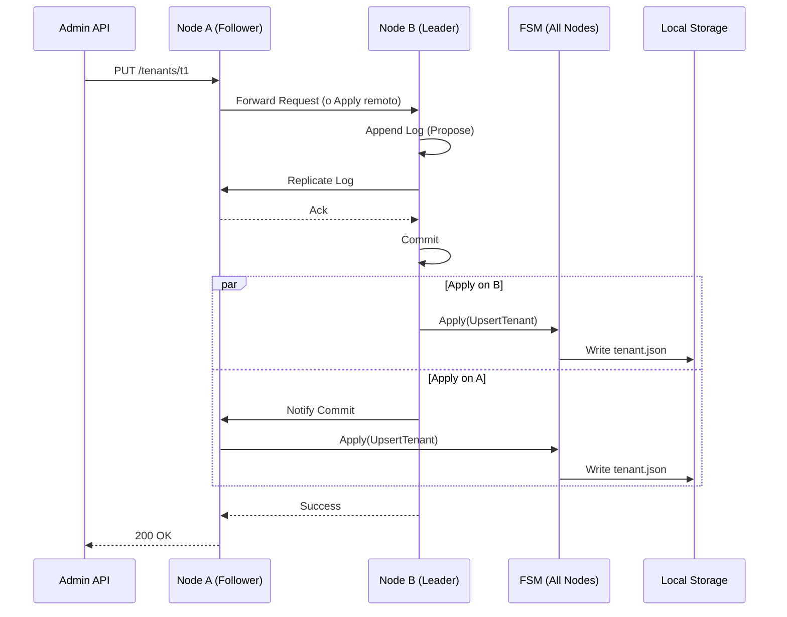

# Arquitectura: Control Plane & Raft Cluster

## Introducción

HelloJohn utiliza una arquitectura distribuida donde el estado de la configuración global (Tenants, Clientes OAuth, Settings) se gestiona a través de un **Control Plane** basado en consenso. Esto permite alta disponibilidad y consistencia fuerte, asegurando que todos los nodos del clúster tengan la misma visión de la configuración.

Categorías cubiertas: `@[internal/controlplane]`, `@[internal/cluster]`, `@[internal/app/cpctx]`.

---

## Control Plane vs Data Plane

Para garantizar escalabilidad y resiliencia, separamos las responsabilidades:

1.  **Control Plane (CP)**:
    *   **Responsabilidad**: Gestión de metadatos (Crear tenants, rotar claves, cambiar políticas).
    *   **Consistencia**: Fuerte (Strong Consistency) vía Raft.
    *   **Escritura**: Centralizada (líder Raft) pero aplicable desde cualquier nodo (forwarding o proxy).
    *   **Lectura**: Local (rápida) una vez replicada.

2.  **Data Plane (DP)**:
    *   **Responsabilidad**: Autenticación de usuarios, emisión de tokens, validación.
    *   **Consistencia**: Eventual (para lecturas de config) pero inmediata para sus propios datos (User DB).
    *   **Escritura**: Distribuida en la BD del tenant.

---

## Cluster Raft Embebido

Implementación en: `internal/cluster`

HelloJohn embebe una instancia de **Hashicorp Raft** en cada nodo del servicio. No requiere etcd o Consul externo; la aplicación *es* el clúster.

### Componentes Clave

*   **Node (`node.go`)**: Wrapper alrededor de `raft.Raft`. Gestiona el ciclo de vida, el transporte TCP/mTLS y el almacenamiento de logs (BoltDB).
*   **FSM (`fsm.go`)**: Finite State Machine. Es el componente que "aplica" los cambios replicados al estado local. Cuando el líder comete una entrada de log (ej: `UpsertTenant`), la FSM de cada nodo se ejecuta para actualizar el almacenamiento local (File System o Cache).
*   **Mutations**: Todas las operaciones de cambio de estado se modelan como "Mutaciones" serializables (JSON) que se envían al log de Raft.

### Flujo de Consenso

### Configuración y Bootstrap
El clúster soporta un modo de "Bootstrap" automático. Si `PEERS` está definido, el nodo con el ID más bajo intentará iniciar el clúster. Esto simplifica el despliegue en entornos estáticos (docker-compose, k8s statefulsets).

---

## Provider del Control Plane

Implementación en: `internal/controlplane/fs`

El `Provider` es la interfaz que el resto de la aplicación usa para leer la configuración. En HelloJohn, la implementación por defecto es `FSProvider`, que lee archivos JSON del disco local.

*   **¿Por qué Filesystem?** Es simple, atómico (rename), fácil de inspeccionar y funciona perfecto con Raft (la FSM escribe archivos).
*   **Provider Context (`cpctx`)**: Un singleton global (o inyectado) que permite acceso rápido a la configuración desde cualquier handler HTTP sin latencia de red.

### Estructuras Importantes (`types.go`)

*   `Tenant`: Define la identidad y settings globales de un inquilino.
*   `TenantSettings`: Configuración encriptada (SMTP, DB DSN) y pública (UserFields, UI customization).
*   `Client`: Aplicaciones OAuth2 registradas.

---

## Seguridad del Clúster

*   **mTLS**: El tráfico entre nodos puede encriptarse con TLS mutuo.
*   **Snapshotting**: Raft toma snapshots periódicos del estado para evitar que el log crezca indefinidamente y acelerar la recuperación de nuevos nodos.
