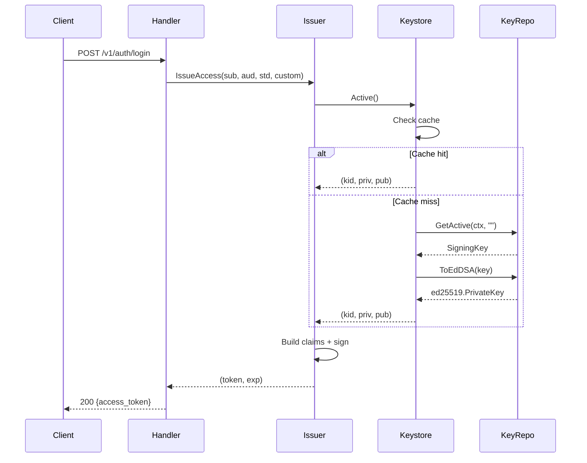

# Paquete `internal/jwt` - Documentación Completa

Infraestructura de firma y validación de JSON Web Tokens (JWT) para `hellojohn`.

---

## Índice

1. [Arquitectura General](#arquitectura-general)
2. [Componentes](#componentes)
3. [Inicialización](#inicialización)
4. [API de Referencia](#api-de-referencia)
5. [Casos de Uso](#casos-de-uso)
6. [Diagrama de Flujo](#diagrama-de-flujo)

---

## Arquitectura General

```
┌──────────────────────────────────────────────────────────────┐
│                         Issuer                               │
│  (Firma tokens, expone JWKS, valida con Keyfunc)             │
└──────────────────────────┬───────────────────────────────────┘
                           │
                           ▼
┌──────────────────────────────────────────────────────────────┐
│                   PersistentKeystore                         │
│  (Cache de claves, acceso a active/retiring keys)            │
└──────────────────────────┬───────────────────────────────────┘
                           │
                           ▼
┌──────────────────────────────────────────────────────────────┐
│               repository.KeyRepository                       │
│  (Store V2 DAL - fs/postgres adapter)                        │
└──────────────────────────────────────────────────────────────┘
```

### Algoritmo de Firma

| Algoritmo | Curva | Descripción |
|-----------|-------|-------------|
| **EdDSA** | Ed25519 | Claves de 256 bits, firmas compactas y rápidas |

---

## Componentes

### Archivos del Paquete

| Archivo | Responsabilidad |
|---------|-----------------|
| `issuer.go` | Emisor de tokens (Access, ID, raw) y resolución de issuer |
| `keystore.go` | Wrapper de `KeyRepository` con caching local |
| `jwks.go` | Helper para construir JWKS JSON manualmente |
| `jwks_cache.go` | Cache de JWKS por tenant con TTL |
| `parse.go` | Validación de tokens EdDSA |
| `keys.go` | Wrappers de crypto helpers (base64url, keycrypto) |

---

## Inicialización

### Paso 1: Abrir Store V2 DAL
```go
import storev2 "github.com/dropDatabas3/hellojohn/internal/store/v2"

dalAdapter, err := storev2.OpenAdapter(ctx, storev2.AdapterConfig{
    Name:             "fs",
    FSRoot:           "/data/hellojohn",
    SigningMasterKey: os.Getenv("SIGNING_MASTER_KEY"),
})
```

### Paso 2: Obtener KeyRepository
```go
keyRepo := dalAdapter.Keys()
```

### Paso 3: Crear PersistentKeystore
```go
ks := jwt.NewPersistentKeystore(keyRepo)

// Generar clave inicial si no existe
if err := ks.EnsureBootstrap(ctx); err != nil {
    log.Printf("WARN: bootstrap key failed: %v", err)
}
```

### Paso 4: Crear Issuer
```go
issuer := jwt.NewIssuer("https://auth.example.com", ks)
issuer.AccessTTL = 15 * time.Minute // opcional
```

---

## API de Referencia

### `Issuer`

#### Constructor
```go
func NewIssuer(iss string, ks *PersistentKeystore) *Issuer
```

#### Métodos

| Método | Descripción | Retorna |
|--------|-------------|---------|
| `IssueAccess(sub, aud, std, custom)` | Emite Access Token global | `(token, exp, error)` |
| `IssueIDToken(sub, aud, std, extra)` | Emite ID Token OIDC global | `(token, exp, error)` |
| `IssueAccessForTenant(tenant, iss, sub, aud, std, custom)` | Access Token con clave de tenant | `(token, exp, error)` |
| `IssueIDTokenForTenant(tenant, iss, sub, aud, std, extra)` | ID Token con clave de tenant | `(token, exp, error)` |
| `SignRaw(claims)` | Firma claims arbitrarios | `(token, kid, error)` |
| `SignEdDSA(claims)` | Firma claims sin inyectar iss/exp | `(token, error)` |
| `ActiveKID()` | Devuelve el KID activo | `(kid, error)` |
| `Keyfunc()` | Keyfunc para validar tokens globales | `jwt.Keyfunc` |
| `KeyfuncForTenant(tenant)` | Keyfunc para validar tokens de tenant | `jwt.Keyfunc` |
| `KeyfuncFromTokenClaims()` | Keyfunc que auto-deriva tenant de claims | `jwt.Keyfunc` |
| `JWKSJSON()` | JWKS JSON global | `[]byte` |
| `WithTenantResolver(fn)` | Inyecta resolver tid→slug | `*Issuer` |

---

### `PersistentKeystore`

#### Constructor
```go
func NewPersistentKeystore(repo repository.KeyRepository) *PersistentKeystore
```

#### Métodos

| Método | Descripción | Retorna |
|--------|-------------|---------|
| `EnsureBootstrap(ctx)` | Genera clave si no existe | `error` |
| `Active()` | Clave activa global | `(kid, priv, pub, error)` |
| `ActiveForTenant(tenant)` | Clave activa de un tenant | `(kid, priv, pub, error)` |
| `PublicKeyByKID(kid)` | Busca pubkey global por KID | `(ed25519.PublicKey, error)` |
| `PublicKeyByKIDForTenant(tenant, kid)` | Busca pubkey en JWKS del tenant | `(ed25519.PublicKey, error)` |
| `JWKSJSON()` | JWKS JSON global (cacheado) | `([]byte, error)` |
| `JWKSJSONForTenant(tenant)` | JWKS JSON de tenant | `([]byte, error)` |
| `RotateFor(tenant, graceSeconds)` | Rota claves de tenant | `(*SigningKey, error)` |

#### Configuración de Cache

| Campo | Default | Descripción |
|-------|---------|-------------|
| `cacheTTL` | 30s | TTL de clave activa en memoria |
| `jwksTTL` | 15s | TTL de JWKS JSON en memoria |

---

### `JWKSCache`

Cache de alto nivel para JWKS por tenant.

#### Constructor
```go
func NewJWKSCache(ttl time.Duration, loader func(string) (json.RawMessage, error)) *JWKSCache
```

#### Métodos

| Método | Descripción |
|--------|-------------|
| `Get(tenant)` | Obtiene JWKS JSON (cacheado o carga) |
| `Invalidate(tenant)` | Invalida cache del tenant (o "global") |

---

### `ParseEdDSA`

```go
func ParseEdDSA(token string, ks *PersistentKeystore, expectedIss string) (map[string]any, error)
```

Valida un JWT EdDSA:
- Busca pubkey por KID o usa la activa
- Valida iss (si se pasa expectedIss)
- Valida exp/nbf con tolerancia de 30 segundos

---

### `ResolveIssuer`

```go
func ResolveIssuer(baseURL, mode, tenantSlug, override string) string
```

Resuelve el issuer efectivo según configuración:

| Modo | Resultado |
|------|-----------|
| `""` (global) | `baseURL` |
| `"path"` | `{baseURL}/t/{slug}` |
| `"domain"` | `{baseURL}/t/{slug}` (futuro: subdominio) |
| Override | Usa override directamente |

---

### Helpers (`keys.go`)

| Función | Descripción |
|---------|-------------|
| `GenerateEd25519()` | Genera par de claves Ed25519 |
| `EncryptPrivateKey(priv, masterKey)` | Cifra clave privada con AES-GCM |
| `DecryptPrivateKey(enc, masterKey)` | Descifra clave privada |
| `EncodeBase64URL([]byte)` | Codifica a base64url sin padding |
| `DecodeBase64URL(string)` | Decodifica base64url |

---

## Casos de Uso

### 1. Emitir Access Token (Login)
```go
std := map[string]any{
    "tid": tenantID,
    "amr": []string{"pwd"},
    "scp": "openid profile",
}
custom := map[string]any{
    "roles": []string{"user"},
}
token, exp, err := issuer.IssueAccess(userID, clientID, std, custom)
```

### 2. Emitir Token Multi-tenant
```go
effIss := jwt.ResolveIssuer(baseURL, "path", tenant.Slug, "")
token, exp, err := issuer.IssueAccessForTenant(
    tenant.Slug, effIss, userID, clientID, std, custom,
)
```

### 3. Validar Token con Keyfunc
```go
keyfunc := issuer.KeyfuncFromTokenClaims()
tok, err := jwtv5.Parse(tokenString, keyfunc, jwtv5.WithValidMethods([]string{"EdDSA"}))
```

### 4. Rotar Claves de Tenant
```go
newKey, err := issuer.Keys.RotateFor("acme", 60) // grace period 60s
jwksCache.Invalidate("acme") // forzar recarga
```

### 5. Exponer JWKS Endpoint
```go
http.HandleFunc("/.well-known/jwks.json", func(w http.ResponseWriter, r *http.Request) {
    data, _ := jwksCache.Get("")
    w.Header().Set("Content-Type", "application/json")
    w.Write(data)
})
```

---

## Diagrama de Flujo



---

## Variables de Entorno Requeridas

| Variable | Descripción | Ejemplo |
|----------|-------------|---------|
| `SIGNING_MASTER_KEY` | Hex 64 chars para cifrar claves privadas | `abc123...` (64 hex) |

---

## Errores Comunes

| Error | Causa | Solución |
|-------|-------|----------|
| `no_active_signing_key` | No hay clave activa | Ejecutar `EnsureBootstrap()` |
| `kid_not_found` | KID del token no existe en JWKS | Token emitido con clave rotada |
| `kid_missing` | Token sin header `kid` | Error del emisor |
| `invalid_jwt` | Firma inválida o token corrupto | Verificar clave/token |
