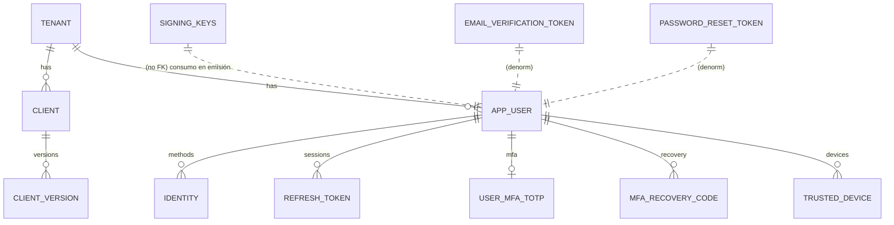
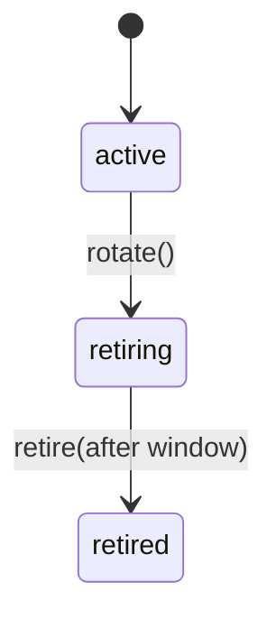

# Migrations – Esquema de Datos y Referencia

Este documento explica en profundidad el estado actual de las migraciones incluidas (PostgreSQL completas, MySQL y Mongo iniciales) y el modelo lógico que soporta el servicio.

## Tabla de Contenido
1. Alcance y fuentes
2. Principios de diseño
3. Esquema principal (PostgreSQL)
4. Entidades detalladas
5. Relaciones y diagrama ER
6. Restricciones, índices y racionales
7. MFA (migración 0002)
8. Diferencias entre Postgres / MySQL / Mongo
9. Triggers y funciones
10. Estrategia de rotación de claves (signing_keys)
11. Patrones de limpieza y mantenimiento
12. Consideraciones futuras / extensiones

---
## 1. Alcance y fuentes
Actualmente existen:

- `postgres/0001_core_up.sql` y `0001_core_down.sql`: Core multi‑tenant, usuarios, identidades, refresh tokens, tokens de email, signing keys.
- `postgres/0002_mfa_up.sql` y `0002_mfa_down.sql`: MFA TOTP, códigos de recuperación y trusted devices.
- `mysql/0001_init.sql`: Esquema parcial (sin tablas de tokens de email, refresh token ni signing_keys todavía).
- `mongo/0001_init.js`: Creación de colecciones base con índices clave (sin tablas MFA ni tokens todavía).

PostgreSQL es la fuente de verdad completa en esta fase (Sprint 5). Otros motores están en fase de bootstrap.

---
## 2. Principios de diseño
| Principio | Descripción |
|----------|-------------|
| Multi‑tenant estricto | Cada recurso de usuario pertenece a un tenant explícito (correo único por tenant, no global). |
| Minimizar coupling | Claves foráneas solo cuando aportan integridad crítica (ej. refresh → user/client). |
| Rotación y auditabilidad | Refresh tokens guardan enlace `rotated_from` para reconstruir cadena. |
| Eliminación segura | `ON DELETE CASCADE` en entidades derivadas (identities, refresh, MFA) para no dejar huérfanos. |
| Hashing y opacidad | Tokens sensibles siempre hash SHA‑256 (binary/bytea) o texto base64url; nunca se guarda el valor plano. |
| Evolución versionada | `client_version` permite schema de claims mutable manteniendo historial. |
| Claves firmantes controladas | `signing_keys` con estados acota superficie de validación y facilita retiros seguros. |

---
## 3. Esquema principal (PostgreSQL)
Migración 0001 crea las tablas centrales y establece índices de búsqueda por email, provider, estado de refresh y manejo de claves.

Migración 0002 añade el subsistema MFA (TOTP + recovery + trusted devices) con su trigger de actualización.

---
## 4. Entidades detalladas
### 4.1 tenant
| Campo | Tipo | Notas |
|-------|------|-------|
| id | UUID PK | `gen_random_uuid()` requiere `pgcrypto`. |
| name | TEXT | Nombre visible. |
| slug | TEXT UNIQUE | Usado en endpoints / UI multi‑tenant. |
| settings | JSONB | Config específica (branding, flags). |
| created_at | TIMESTAMPTZ | Default `now()`. |

### 4.2 client
| Campo | Tipo | Notas |
|-------|------|-------|
| id | UUID PK | |
| tenant_id | UUID FK → tenant ON DELETE CASCADE | Aislamiento. |
| name | TEXT | Display. |
| client_id | TEXT UNIQUE | Identificador público OAuth2. |
| client_type | TEXT CHECK ('public','confidential') | Influye en manejo de secreto. |
| redirect_uris | TEXT[] | Lista validada en authorize. |
| allowed_origins | TEXT[] | CORS / postMessage. |
| providers | TEXT[] | Proveedores sociales permitidos. |
| scopes | TEXT[] | Scopes pre-registrados. |
| active_version_id | UUID NULL FK → client_version | Set NULL al borrar versión. |
| created_at | TIMESTAMPTZ | |

### 4.3 client_version
| Campo | Tipo | Notas |
|-------|------|-------|
| id | UUID PK | |
| client_id | UUID FK → client | Cascade. |
| version | TEXT | Identificador semántico (e.g. "v1", commit). |
| claim_schema_json | JSONB | Validación estructural de claims. |
| claim_mapping_json | JSONB | Mapeo atributos internos → claims. |
| crypto_config_json | JSONB | Parametrización (alg futuro, kid hints). |
| status | TEXT CHECK ('draft','active','retired') | Solo una active referenciada. |
| created_at | TIMESTAMPTZ | |
| promoted_at | TIMESTAMPTZ | Marca transición a active. |

### 4.4 app_user
| Campo | Tipo | Notas |
|-------|------|-------|
| id | UUID PK | |
| tenant_id | UUID FK → tenant | Cascada. |
| email | TEXT | Único por tenant. |
| email_verified | BOOLEAN | Estado de verificación. |
| status | TEXT | `active` / futuro: `disabled`, `locked`. |
| metadata | JSONB | Atributos personalizados. |
| created_at | TIMESTAMPTZ | |
| UNIQUE (tenant_id,email) | | Previene duplicados cross-tenant. |

### 4.5 identity
| Campo | Tipo | Notas |
|-------|------|-------|
| id | UUID PK | |
| user_id | UUID FK → app_user | Cascada. |
| provider | TEXT CHECK('password','google','facebook') | Tipo de factor. |
| provider_user_id | TEXT | ID federado (sub Google). |
| email | TEXT | Copia defensiva (social). |
| email_verified | BOOLEAN | Estado federado. |
| password_hash | TEXT | Solo provider=password. |
| created_at | TIMESTAMPTZ | |
| UNIQUE(user_id,provider) | | Evita duplicados mismos provider. |
| IDX(provider,provider_user_id) | | Búsqueda social. |

### 4.6 refresh_token
| Campo | Tipo | Notas |
|-------|------|-------|
| id | UUID PK | |
| user_id | UUID FK → app_user | Cascada. |
| client_id | UUID FK → client | Cascada. |
| token_hash | TEXT UNIQUE | SHA-256 (base64url / hex). |
| issued_at | TIMESTAMPTZ | Creación. |
| expires_at | TIMESTAMPTZ | TTL absoluto. |
| rotated_from | UUID FK → refresh_token(id) SET NULL | Cadena de rotación. |
| revoked_at | TIMESTAMPTZ NULL | Revocación temprana. |
| IDX(user_id, client_id) | | Recuperación por sesión. |
| IDX(user_id) partial revoked_at IS NULL | | Listado activos. |
| IDX(expires_at) partial revoked_at IS NULL | | Limpieza programada. |

### 4.7 email_verification_token
| Campo | Tipo | Notas |
|-------|------|-------|
| id | UUID PK | |
| tenant_id | UUID | Denormalizado (sin FK explícita). |
| user_id | UUID | Denormalizado (sin FK) para tolerar cleanup user. |
| token_hash | BYTEA UNIQUE | SHA-256 crudo; nunca plano. |
| sent_to | TEXT | Correo destino. |
| ip | INET | Origen solicitud. |
| user_agent | TEXT | Telemetría. |
| created_at | TIMESTAMPTZ | |
| expires_at | TIMESTAMPTZ | | 
| used_at | TIMESTAMPTZ | Marca consumo. |
| IDX(expires_at) | | Cleanup. |
| IDX(tenant_id,user_id) | | Búsquedas operativas. |

### 4.8 password_reset_token
Mismo patrón que verificación: hash, expiración, `used_at`. Aislamiento evita enumeración.

### 4.9 signing_keys
| Campo | Tipo | Notas |
|-------|------|-------|
| kid | TEXT PK | Identificador estable. |
| alg | TEXT CHECK(= 'EdDSA') | Fijo. |
| public_key | BYTEA | Clave pública Ed25519. |
| private_key | BYTEA | Cifrada opcional (prefijo GCMV1). |
| status | TEXT CHECK('active','retiring','retired') | Estados ciclo. |
| not_before | TIMESTAMPTZ | Tiempo desde el cual es válida. |
| created_at | TIMESTAMPTZ | Inserción. |
| rotated_at | TIMESTAMPTZ | Momento de transición a retiring. |
| UNIQUE INDEX(status='active') | | Garantiza una sola activa. |
| IDX(status) | | Consultas JWKS. |
| IDX(not_before) | | Validaciones. |

### 4.10 user_mfa_totp (0002)
| Campo | Tipo | Notas |
|-------|------|-------|
| user_id | UUID PK FK → app_user | 1:1 usuario ↔ secreto. |
| secret_encrypted | TEXT | AES‑GCM (prefijo GCMV1-MFA). |
| confirmed_at | TIMESTAMPTZ | Momento de verificación inicial. |
| last_used_at | TIMESTAMPTZ | Auditar uso. |
| created_at | TIMESTAMPTZ | |
| updated_at | TIMESTAMPTZ | Actualizado por trigger. |

### 4.11 mfa_recovery_code (0002)
| Campo | Tipo | Notas |
|-------|------|-------|
| id | BIGSERIAL PK | |
| user_id | UUID FK → app_user | |
| code_hash | TEXT | SHA-256 base64url(lower). |
| used_at | TIMESTAMPTZ | Marca consumo. |
| created_at | TIMESTAMPTZ | |
| UNIQUE(user_id,code_hash) | | Evita duplicados. |

### 4.12 trusted_device (0002)
| Campo | Tipo | Notas |
|-------|------|-------|
| id | BIGSERIAL PK | |
| user_id | UUID FK → app_user | |
| device_hash | TEXT | Hash cookie remember. |
| created_at | TIMESTAMPTZ | |
| expires_at | TIMESTAMPTZ | TTL política. |
| IDX(user_id) | | Listado/limpieza por usuario. |
| UNIQUE(user_id,device_hash) | | Evita colisiones. |

---
## 5. Relaciones y diagrama ER


Nota: Tokens de email y reset no tienen FK para permitir limpieza diferida incluso si el usuario fue borrado (evita errores referenciales durante tasks de housekeeping).

---
## 6. Restricciones, índices y racionales
| Elemento | Tipo | Razón |
|----------|------|-------|
| UNIQUE(slug) en tenant | Unicidad URL / lookup rápido | Multi‑tenant routing. |
| UNIQUE(client.client_id) | Identificación pública OAuth2 | Requerido especificación. |
| CHECK(client_type) | Validación temprana | Enforce contrato de emisión. |
| UNIQUE(tenant_id,email) | Evitar colisiones cross-tenant | Integridad de login. |
| UNIQUE(user_id,provider) | Un solo registro por método | Permite upsert limpio. |
| refresh_token token_hash UNIQUE | Previene duplicates + lookup O(1) | Rotación consistente. |
| refresh_token partial idx activos | Filtrado rápido en revocaciones | Eficiencia. |
| signing_keys UNIQUE(status='active') | Garantiza 1 sola activa | Simplifica emisión. |
| mfa_recovery_code UNIQUE(user_id,code_hash) | Evita regenerar duplicados | Seguridad. |
| trusted_device UNIQUE(user_id,device_hash) | Evita reuse hash | Integridad remember. |
| email/password reset token_hash UNIQUE | One‑use garantizado | Seguridad enlaces. |

Decisiones: algunas tablas de token (email/reset) omiten FK para permitir que un proceso que borra usuarios primero no bloquee el purge de tokens históricos.

---
## 7. MFA (migración 0002)
Incorpora tres tablas independientes para mantener cohesión:

- `user_mfa_totp`: estado y secreto cifrado. PK = user_id (1:1).
- `mfa_recovery_code`: lista (normalmente 10) de códigos hash. Inserciones atómicas al confirmar / rotar.
- `trusted_device`: tokens remember persistidos para saltar MFA temporalmente.

Esto desacopla la lógica MFA del resto del ciclo de refresh. No se agregan columnas nuevas a `app_user` manteniendo bajo el impacto de cambios.

### 7.1 Scopes & Consents (migración 0003)
Introduce tablas:

```
CREATE TABLE scope (
  id UUID PK DEFAULT gen_random_uuid(),
  tenant_id UUID NOT NULL REFERENCES tenant(id) ON DELETE CASCADE,
  name TEXT NOT NULL,
  description TEXT NOT NULL DEFAULT '',
  created_at TIMESTAMPTZ NOT NULL DEFAULT now(),
  UNIQUE(tenant_id,name)
);

CREATE TABLE user_consent (
  id UUID PK DEFAULT gen_random_uuid(),
  user_id UUID NOT NULL REFERENCES app_user(id) ON DELETE CASCADE,
  client_id UUID NOT NULL REFERENCES client(id) ON DELETE CASCADE,
  granted_scopes TEXT[] NOT NULL,
  granted_at TIMESTAMPTZ NOT NULL DEFAULT now(),
  revoked_at TIMESTAMPTZ NULL,
  UNIQUE(user_id, client_id)
);
```

Índices:
* `idx_scope_tenant_name (tenant_id,name)` búsqueda rápida y ref interna.
* `idx_user_consent_user_active` filtro activos por usuario.
* `idx_user_consent_client_active` filtro activos por cliente.
* `idx_user_consent_scopes_gin` GIN para búsquedas por scopes (future UI / auditoría).

Decisiones clave:
* `granted_scopes` como `TEXT[]` flexible evita tabla pivote, reduce joins en lectura típica (listar consentimientos de usuario).
* No hay FK desde `granted_scopes` a `scope.name` ⇒ integridad lógica implementada en aplicación (delete guard manual).
* Eliminación de scope válida solo si ningún consentimiento activo del mismo tenant contiene el nombre.

Riesgo mitigado: inconsistencia de tokens emitidos referenciando scopes no registrados. El guardia evita que un scope desaparezca mientras se mantiene un consentimiento activo que lo incluye.

### 7.2 RBAC preliminar (migración 0004)
Archivos `0004_rbac_up.sql` / `0004_rbac_down.sql` (si presentes) introducen un mapa minimal de roles y permisos multi‑tenant (pendiente de finalización):
* Tablas esperadas: `role` (tenant_id, name), `role_perm` (tenant_id, role, perm), `user_role` (user_id, role, tenant_id).
* Índices compuestos para `tenant_id, role` y GIN/BTREE sobre permisos según cardinalidad.
* Handlers ya implementados (`admin_rbac.go`) operan mediante type assertions sobre el store; sin migración activa devuelven 501.

Racional de diseño:
* Separar RBAC de scopes OAuth2 (servicios distintos: autorización UI/API vs delegación OAuth).
* Permitir evolución incremental: primera fase solo agrega/quita roles/perms en memoria/DB sin caching avanzado.

---
## 8. Diferencias entre Postgres / MySQL / Mongo
| Aspecto | PostgreSQL | MySQL inicial | Mongo inicial |
|---------|------------|---------------|---------------|
| Cobertura | Completa (core + tokens + signing + MFA) | Parcial (tenant, client, client_version, app_user, identity) | Parcial (colecciones equivalentes) |
| Arrays | TEXT[] nativo | JSON (arrays) | Arrays en docs JSON |
| JSON | JSONB rico | JSON (sin ops avanzadas) | Nativo BSON |
| Extensión | pgcrypto para UUID gen | N/A | N/A |
| MFA | Sí (0002) | No aún | No aún |
| Refresh tokens | Sí | No | No |
| Email/reset tokens | Sí | No | No |
| signing_keys | Sí | No | No |

La prioridad de implementación de paridad: 1) refresh_token, 2) signing_keys, 3) tokens email/reset, 4) MFA en MySQL/Mongo.

---
## 9. Triggers y funciones
Solo existe un trigger actualmente:

| Nombre | Tabla | Momento | Propósito |
|--------|-------|---------|-----------|
| user_mfa_totp_updated_at | user_mfa_totp | BEFORE UPDATE | Refrescar `updated_at` automáticamente. |

Función asociada: `trg_user_mfa_totp_updated_at()` (PL/pgSQL) – idempotente mediante `OR REPLACE`.

No hay otros triggers en migraciones actuales (rotación de claves y lógica MFA se gestionan desde aplicación).

---
## 10. Estrategia de rotación de claves (signing_keys)
Estados:



- `active`: se usa para firmar nuevos JWT.
- `retiring`: permanece visible en JWKS para validar tokens aún no expirados.
- `retired`: ya no aparece en JWKS; sólo referencia histórica.

Un índice único en `status WHERE status='active'` garantiza que la aplicación implemente “exactamente una” clave activa.

---
## 11. Patrones de limpieza y mantenimiento
| Tabla | Criterio limpieza | Estrategia |
|-------|-------------------|-----------|
| refresh_token | expires_at < now OR revoked_at NOT NULL | Job periódico borra cadenas antiguas completas. |
| email_verification_token | expires_at < now OR used_at NOT NULL | Purge batch (mantener X días si auditoría). |
| password_reset_token | expires_at < now OR used_at NOT NULL | Igual que verificación. |
| mfa_recovery_code | used_at NOT NULL y edad > ventana | Opcional mantener para auditoría. |
| trusted_device | expires_at < now | Borrado directo. |
| signing_keys | status='retired' y antigüedad > umbral | Archivado o eliminación. |

Indices parciales soportan consultas de selección rápida para cada job.

---
## 12. Consideraciones futuras / extensiones
| Área | Posible cambio | Nota |
|------|---------------|------|
| Auditoría | Tabla `audit_event` con JSONB y particionado por fecha | Minimiza impacto en OLTP principal. |
| Revocación selectiva | FK desde trusted_device a refresh_token para invalidar sesiones por device | Aumenta cardinalidad; evaluar. |
| WebAuthn | Tabla `user_webauthn_credential` (id, user_id, pubkey, sign_count) | Complementa TOTP. |
| OAuth consents | Tabla `user_consent` (user_id, client_id, scopes, granted_at) | Para UI de revocación. |
| Scope registry | Tabla `scope_definition` para validación de server side | Evita scopes huérfanos. |
| Soft delete usuarios | Campo `deleted_at` en app_user + vistas filtradas | Preserva integridad histórica. |
| Partitioning refresh | Particionar refresh_token por mes o hash | Mejora limpieza masiva. |

### 12.1 Posibles mejoras Scopes/Consents
| Mejora | Descripción |
|--------|-------------|
| Tabla pivote opcional | Reemplazar `TEXT[]` por `scope_grant(scope_id, consent_id)` si se requiere FK estricta | 
| Auditoría consent | Tabla `consent_event` (grant, extend, revoke) con diff de scopes | 
| TTL de consentimiento | Campo `expires_at` para consentimientos temporales | 
| Revocación granular | Endpoint para remover un subconjunto de scopes sin revocar todos | 

### 12.2 Estrategia FK futura
Si se adopta tabla pivote, se migraría así:
1. Crear tabla `scope_grant(consent_id FK, scope_id FK)` poblarla con UNNEST de `granted_scopes`.
2. Marcar `granted_scopes` como deprecated manteniendo sincronización disparada por triggers.
3. Finalmente eliminar `granted_scopes` tras una ventana de compatibilidad.

---
### Notas Sprint 6
* Añadida migración 0003 consolidando soporte dinámico de scopes y consentimiento administrable.
* Delete guard implementado a nivel repositorio (consultas EXISTS) antes de borrar scopes.
* Preparado esqueleto RBAC (0004) para roles/permisos multi‑tenant.

---
### Resumen rápido
- Postgres listo para producción (core + MFA + claves + tokens email/reset).
- Motores alternativos aún incompletos: requieren paridad antes de uso serio.
- Modelo favorece extensibilidad y rotación segura de tokens/keys.

© 2025 HelloJohn – Documento de esquema. Cambios estructurales deben reflejarse aquí.
